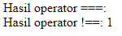
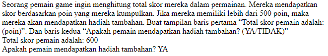

# Jobsheet 4 : PHP

**Nama :** Lavina<br>
**NIM :** 2342760062<br>
**Kelas :** SIB 2D<br>

### **Praktikum Bagian 1. Variabel dan Konstanta**

`variabel-konstanta.php`

```php
<?php
$angka1 = 10;
$angka2 = 5;
$hasil = $angka1 + $angka2;

echo "Hasil penjumlahan $angka1 dan $angka2 adalah $hasil<br>";

$benar = true;
$salah = false;

echo "Variabel benar: $benar, Variabel salah: $salah<br>";

define("NAMA_SITUS", "Websiteku.com");
define("TAHUN_PENDIRIAN", "2023");

echo "Selamat datang di " . NAMA_SITUS . ", situs yang didirikan pada tahun " . TAHUN_PENDIRIAN . ".<br>";
```

**Hasil Percobaan**<br>
<br>

**Penjelasan:** Pada bahasa pemrograman PHP, variabel dideklarasikan dengan diawali tanda `$` dan mengikuti nama variabel. Variabel ini dapat menyimpan nilai yang bertipe data seperti angka, string, boolean, array, dan lainnya. Variabel juga bisa menyimpan hasil dari operasi matematika, perbandingan, dan logika. Untuk menggabungkan string, gunakan operator `.`. Define merupakan fungsi yang digunakan untuk mendefinisikan konstanta, pada parameter pertamanya berisi nama konstanta dan parameter kedua berisi nilai konstanta.

### **Praktikum 2 : Penggunaan Tipe Data**

`tipe_data.php`

```php
<?php
$a = 10;
$b = 5;
$c = $a + 5;
$d = $b + (10 * 5);
$e = $d - $c;

echo "Variabel a: {$a}<br>";
echo "Variabel b: {$b}<br>";
echo "Variabel c: {$c}<br>";
echo "Variabel d: {$d}<br>";
echo "Variabel e: {$e}<br>";

var_dump($e);

$nilaiMatematika = 5.1;
$nilaiIPA = 6.7;
$nilaiBahasaIndonesia = 9.3;

$rataRata = ($nilaiMatematika + $nilaiIPA + $nilaiBahasaIndonesia) / 3;

echo "Matematika: {$nilaiMatematika}<br>";
echo "IPA: {$nilaiIPA}<br>";
echo "Bahasa Indonesia: {$nilaiBahasaIndonesia}<br>";
echo "Rata-rata: {$rataRata}<br>";

var_dump($rataRata);

$apakahSiswaLulus = true;
$apakahSiswaSudahUjian = false;

var_dump($apakahSiswaLulus);
echo "<br>";
var_dump($apakahSiswaSudahUjian);

$namaDepan = "Ibnu";
$namaBelakang = "Jakaria";

$namaLengkap = "{$namaDepan} {$namaBelakang}";
$namaLengkap2 = $namaDepan . " " . $namaBelakang;

echo "Nama Depan: {$namaDepan}<br>";
echo "Nama Belakang: " . $namaBelakang . "<br>";

echo $namaLengkap;

$listMahasiswa = ["Wahid Abdullah", "Muhammad Rizki", "Muhammad Zakaria"];
echo $listMahasiswa[0];
```

**Hasil Percobaan**<br>
<br>

**Penjelasan:** Tipe data dalam PHP tidak perlu ditentukan secara eksplisit, karena tipe data yang digunakan akan secara otomatis terdeteksi oleh sistem. Variabel bisa dioperasikan dengan menggunakan operator aritmatika, perbandingan, dan logika. var_dump() adalah fungsi yang digunakan untuk menampilkan informasi tentang variabel yang diberikan. Penggabungan string bisa menggunakan operator `.` atau menggunakan fungsi `concat()` dan kurung kurawal.

### **Praktikum Bagian 3 : Penggunaan Operator PHP**

**Operator Aritmatika**<br>

`operator.php`

```php
<?php
$a = 10;
$b = 5;

$hasilTambah = $a + $b;
$hasilKurang = $a - $b;
$hasilKali = $a * $b;
$hasilBagi = $a / $b;
$sisaBagi = $a % $b;
$pangkat = $a ** $b;

echo "Hasil Tambah: {$hasilTambah}<br>";
echo "Hasil Kurang: {$hasilKurang}<br>";
echo "Hasil Kali: {$hasilKali}<br>";
echo "Hasil Bagi: {$hasilBagi}<br>";
echo "Hasil Sisa Bagi: {$sisaBagi}<br>";
echo "Pangkat: {$pangkat}<br>";
```

**Hasil Percobaan**<br>
<br>

**Penjelasan:** Percobaan diatas menunjukkan penggunaan operator aritmatika `+` untuk menjumlahkan dua variabel, operator pengurangan `-` untuk mengurangi dua variabel, operator kali `*` untuk melakukan perkalian dua variabel, operator pembagian `/` untuk melakukan pembagian dua variabel, operator modulus `%` untuk melakukan modulus dari dua variabel, dan operator pangkat `**` untuk melakukan pangkat dari dua variabel.<br>

**Operator Perbandingan**<br>
`operator.php`

```php
$hasilSama = $a == $b;
$hasilTidakSama = $a != $b;
$hasilLebihKecil = $a < $b;
$hasilLebihBesar = $a > $b;
$hasilLebihKecilAtauSama = $a <= $b;
$hasilLebihBesarAtauSama = $a >= $b;

echo "Hasil Sama: {$hasilSama}<br>";
echo "Hasil Tidak Sama: {$hasilTidakSama}<br>";
echo "Hasil Lebih Kecil: {$hasilLebihKecil}<br>";
echo "Hasil Lebih Besar: {$hasilLebihBesar}<br>";
echo "Hasil Lebih Kecil Atau Sama: {$hasilLebihKecilAtauSama}<br>";
echo "Hasil Lebih Besar Atau Sama: {$hasilLebihBesarAtauSama}<br>";
```

**Hasil Percobaan**<br>
<br>

**Penjelasan:** Operator perbandingan digunakan untuk membandingkan dua variabel, mengembalikan nilai `true` jika dua variabel sama, mengembalikan nilai `false` jika dua variabel tidak sama. Operator `==` digunakan untuk membandingkan dua variabel, mengembalikan nilai `true` jika dua variabel sama, mengembalikan nilai `false` jika dua variabel tidak sama. Operator `!=` digunakan untuk membandingkan dua variabel, mengembalikan nilai `true` jika dua variabel tidak sama, mengembalikan nilai `false` jika dua variabel sama. Operator `<` digunakan untuk membandingkan dua variabel, mengembalikan nilai `true` jika variabel pertama lebih kecil dari variabel kedua, mengembalikan nilai `false` jika tidak. Operator `>` digunakan untuk membandingkan dua variabel, mengembalikan nilai `true` jika variabel pertama lebih besar dari variabel kedua, mengembalikan nilai `false` jika tidak. Operator `<=` digunakan untuk membandingkan dua variabel, mengembalikan nilai `true` jika variabel pertama lebih kecil atau sama dengan variabel kedua, mengembalikan nilai `false` jika tidak. Operator `>=` digunakan untuk membandingkan dua variabel, mengembalikan nilai `true` jika variabel pertama lebih besar atau sama dengan variabel kedua, mengembalikan nilai `false` jika tidak.<br>

**Operator Logika**<br>
`operator.php`

```php
$hasilAnd = $a && $b;
$hasilOr = $a || $b;
$hasilNotA = !$a;
$hasilNotB = !$b;

echo "Hasil operator AND: {$hasilAnd}<br>";
echo "Hasil operator OR: {$hasilOr}<br>";
echo "Hasil operator NOT A: {$hasilNotA}<br>";
echo "Hasil operator NOT B: {$hasilNotB}<br>";
```

**Hasil Percobaan**<br>
<br>

**Penjelasan:** Operator `&&` mengembalikan nilai `true` jika dua variabel bernilai `true`, mengembalikan nilai `false` jika dua variabel bernilai `false`. Operator `||` mengembalikan nilai `true` jika salah satu variabel bernilai `true`, mengembalikan nilai `false` jika kedua variabel bernilai `false`. Operator `!` mengembalikan nilai `true` jika variabel bernilai `false`, mengembalikan nilai `false` jika variabel bernilai `true`.<br>

**Operator Penugasan**<br>

`operator.php`

```php
$a = 10;
$b = 5;

$a += $b;
echo "Hasil operator +=: {$a}<br>";

$a = 10;
$a -= $b;
echo "Hasil operator -=: {$a}<br>";

$a = 10;
$a *= $b;
echo "Hasil operator *=: {$a}<br>";

$a = 10;
$a /= $b;
echo "Hasil operator /=: {$a}<br>";

$a = 10;
$a %= $b;
echo "Hasil operator %=: {$a}<br>";
```

**Hasil Percobaan**<br>
<br>

**Penjelasan:** Operator penugasan digunakan untuk melakukan pengurangan, perkalian, pembagian, atau modulus pada variabel. Dengan operator ini penulisan kode yang lebih efisien dan mudah dibaca.<br>

**Operator Identitas**<br>
`operator.php`

```php
$hasilIdentik = $a === $b;
$hasilTidakIdentik = $a !== $b;

echo "Hasil operator ===: {$hasilIdentik}<br>";
echo "Hasil operator !==: {$hasilTidakIdentik}<br>";
```

**Hasil Percobaan**<br>
<br>

**Penjelasan:** Operator identitas digunakan untuk membandingkan dua variabel, mengembalikan nilai `true` jika dua variabel sama, mengembalikan nilai `false` jika dua variabel tidak sama.<br>

**Studi Kasus**<br>
Sebuah restoran memiliki 45 kursi di dalamnya. Pada suatu malam, 28 kursi telah ditempati oleh pelanggan. Berapa persen kursi yang masih kosong di restoran tersebut?<br>

`operator.php`

```php
echo "Sebuah restoran memiliki 45 kursi di dalamnya. Pada suatu malam, 28 kursi telah ditempati oleh pelanggan.<br>Berapa persen kursi yang masih kosong di restoran tersebut?<br>";

$kursi = 45;
$kursiKosong = 28;
$persenKursiKosong = ($kursi - $kursiKosong) / $kursi * 100;

echo "Persen kursi yang masih kosong di restoran tersebut: {$persenKursiKosong}%<br>";
```

**Hasil Percobaan**<br>
<br>

### **Praktikum Bagian 4 : Penggunaan Struktur Kontrol Pada PHP**

**if else**<br>
`struktur_kontrol.php`

```php
<?php
$nilaiNumerik = 92;

if ($nilaiNumerik >= 90 && $nilaiNumerik <= 100) {
  echo "Nilai huruf: A";
} else if ($nilaiNumerik >= 80 && $nilaiNumerik < 90) {
  echo "Nilai huruf: B";
} else if ($nilaiNumerik >= 70 && $nilaiNumerik < 80) {
  echo "Nilai huruf: C";
} else if ($nilaiNumerik < 70) {
  echo "Nilai huruf: D";
}
```

**Hasil Percobaan**<br>
<br>

**Penjelasan:** Kode diatas menunjukkan contoh penggunaan struktur conditional statement if-else if pada PHP dengan studi kasus konversi nilai angka ke nilai huruf.<br>

**loop for**<br>
`struktur_kontrol.php`

```php
$jumlahLahan = 10;
$tanamanPerLahan = 5;
$buahPerTanaman = 10;
$jumlahBuah = 0;

for ($i = 1; $i <= $jumlahLahan; $i++) {
  $jumlahBuah += ($tanamanPerLahan * $buahPerTanaman);
}

echo "Jumlah buah yang akan dipanen adalah: $jumlahBuah<br>";
```

**Hasil Percobaan**<br>  
<br>

**Penjelasan:** Kode diatas menunjukkan contoh penggunaan struktur looping pada PHP dengan studi kasus menghitung jumlah buah yang akan dipanen.<br>

**loop foreach**<br>
`struktur_kontrol.php`

```php
$skorUjian = [85, 92, 78, 96, 88];
$totalSkor = 0;

foreach ($skorUjian as $skor) {
  $totalSkor += $skor;
}

echo "Total skor ujian: $totalSkor<br>";
```

**Hasil Percobaan**<br>
<br>

**Penjelasan:** Kode diatas menunjukkan contoh penggunaan struktur looping dengan menggunakan foreach pada PHP dengan studi kasus menghitung total skor ujian.<br>

`struktur_kontrol.php`

```php
$nilaiSiswa = [85, 92, 58, 64, 90, 55, 88, 79, 70, 96];

foreach ($nilaiSiswa as $nilai) {
  if ($nilai < 60) {
    echo "Nilai: $nilai (Tidak Lulus) <br>";
    continue;
  }
  echo "Nilai: $nilai (Lulus) <br>";
}
```

**Hasil Percobaan**<br>
<br>

**Penjelasan:** Kode diatas melakukan loop pada nilai lalu dicek apakah nilai kurang 60 jika `true` maka tidak lulus, dan lulus apabila `false`. Sintaks `continue` digunakan untuk melewatkan kode setelahnya ketika kondisi terpenuhi, sehingga ketika suatu nilai itu tidak lulus, maka tidak akan mencetak kode yang menyatakan lulus yg ada dibawahnya.<br>

**Studi Kasus 1**<br>
Ada seorang guru ingin menghitung total nilai dari 10 siswa dalam ujian matematika. Guru ini ingin mengabaikan dua nilai tertinggi dan dua nilai terendah. Bantu guru ini menghitung total nilai yang akan digunakan untuk menentukan nilai rata-rata setelah mengabaikan nilai tertinggi dan terendah. Berikut daftar nilai dari 10 siswa (85, 92, 78, 64, 90, 75, 88, 79, 70, 96)<br>

`struktur_kontrol.php`

```php
echo "Ada seorang guru ingin menghitung total nilai dari 10 siswa dalam ujian matematika. Guru ini ingin mengabaikan dua nilai tertinggi dan dua nilai terendah. Bantu guru ini menghitung total nilai yang akan digunakan untuk menentukan nilai rata-rata setelah mengabaikan nilai tertinggi dan terendah. Berikut daftar nilai dari 10 siswa (85, 92, 78, 64, 90, 75, 88, 79, 70, 96)<br>";
$nilaiSiswa2 = [85, 92, 78, 64, 90, 75, 88, 79, 70, 96];
$totalNilai = 0;

sort($nilaiSiswa2); // setelah disort -> [64, 70, 75, 78, 79, 85, 88, 90, 92, 96]

for ($i = 0; $i < count($nilaiSiswa2); $i++) {
  // i = 0 - 9
  // index 0 - 1 -> nilai terendah
  // index 8 - 9 -> nilai tertinggi
  if ($i >  1 && $i < 8) {
    $totalNilai += $nilaiSiswa2[$i];
  }
}

echo "Total nilai: $totalNilai<br>";

$rataRata = $totalNilai / 8;
echo "Nilai rata-rata: $rataRata<br>";
```

**Hasil Percobaan**<br>
<br>

**Studi Kasus 2**<br>
Seorang pelanggan ingin membeli sebuah produk dengan harga Rp 120.000. Toko tersebut menawarkan diskon sebesar 20% untuk pembelian di atas Rp 100.000. Bantu pelanggan ini untuk menghitung harga yang harus dibayar setelah mendapatkan diskon.<br>

`struktur_kontrol.php`

```php
echo "Seorang pelanggan ingin membeli sebuah produk dengan harga Rp 120.000. Toko tersebut menawarkan diskon sebesar 20% untuk pembelian di atas Rp 100.000. Bantu pelanggan ini untuk menghitung harga yang harus dibayar setelah mendapatkan diskon.<br>";
$hargaProduk = 120_000;
$diskon = 0.2;

if ($hargaProduk >= 100_000) {
  $hargaDiskon = ($hargaProduk * $diskon);
}

$totalBayar = $hargaProduk - $hargaDiskon;
echo "Harga yang harus dibayar: $totalBayar<br>";
```

**Hasil Percobaan**<br>
<br>

**Studi Kasus 3**<br>
Seorang pemain game ingin menghitung total skor mereka dalam permainan. Mereka mendapatkan skor berdasarkan poin yang mereka kumpulkan. Jika mereka memiliki lebih dari 500 poin, maka mereka akan mendapatkan hadiah tambahan. Buat tampilan baris pertama “Total skor pemain adalah: (poin)”. Dan baris kedua “Apakah pemain mendapatkan hadiah tambahan? (YA/TIDAK)”<br>

`struktur_kontrol.php`

```php
echo "Seorang pemain game ingin menghitung total skor mereka dalam permainan. Mereka mendapatkan skor berdasarkan poin yang mereka kumpulkan. Jika mereka memiliki lebih dari 500 poin, maka mereka akan mendapatkan hadiah tambahan. Buat tampilan baris pertama “Total skor pemain adalah: (poin)”. Dan baris kedua “Apakah pemain mendapatkan hadiah tambahan? (YA/TIDAK)”<br>";
$poin = 600;

echo "Total skor pemain adalah: $poin<br>";

$hadiah = ($poin > 500) ? "YA" : "TIDAK";
echo "Apakah pemain mendapatkan hadiah tambahan? $hadiah<br>";
```

**Hasil Percobaan**<br>
<br>

### **Praktikum 5: Penggunaan Array Pada PHP**

**Array Satu Dimensi**<br>
`array.php`

```php
<?php
$nilaiSiswa = [85, 92, 58, 64, 90, 55, 88, 79, 70, 96];
$nilaiLulus = [];

foreach ($nilaiSiswa as $nilai) {
  if ($nilai >= 70) {
    $nilaiLulus[] = $nilai;
  }
}

echo "Daftar nilai siswa yang lulus: " . implode(", ", $nilaiLulus) . "<br>";
```

**Hasil Percobaan**<br>
<br>

**Penjelasan:** Percobaan diatas adalah cara mendeklarasi array satu dimensi di PHP. Array tersebut diloop untuk nantinya setiap nilainya dicek apakah lebih dari sama dengan 70 jika `true` maka lulus dan sebaliknya tidak lulus.<br>

**Array Dua Dimensi**<br>

`array.php`

```php
$daftarKaryawan = [
  ['Alice', 7],
  ['Bob', 3],
  ['Charlie', 9],
  ['David', 5],
  ['Eve', 2]
];

$karyawanPengalamanLimaTahun = [];

foreach ($daftarKaryawan as $karyawan) {
  if ($karyawan[1] >= 5) {
    $karyawanPengalamanLimaTahun[] = $karyawan[0];
  }
}

echo "Daftar karyawan dengan pengalaman kerja lebih dari 5 tahun: " . implode(", ", $karyawanPengalamanLimaTahun) . "<br>";
```

**Hasil Percobaan**<br>
<br>

**Penjelasan:** Percobaan diatas adalah contoh penggunaan array dua dimensi di PHP dengan studi kasus pengecekan berapa tahun pengalaman kerja karyawan. Pada arraynya kolom 1 berisi nama karyawan, dan kolom 2 berisi tahun pengalaman kerja.<br>

**Array Multidimensi**<br>
`array.php`

```php
$daftarNilai = [
  'Matematika' => [
    ['Alice', 85],
    ['Bob', 92],
    ['Charlie', 78],
  ],
  'Fisika' => [
    ['Alice', 90],
    ['Bob', 88],
    ['Charlie', 75],
  ],
  'Kimia' => [
    ['Alice', 92],
    ['Bob', 80],
    ['Charlie', 85],
  ]
];

$mataKuliah = 'Fisika';

echo "Daftar nilai mahasiswa dalam mata kuliah $mataKuliah: <br>";

foreach ($daftarNilai[$mataKuliah] as $nilai) {
  echo "Nama: {$nilai[0]}, Nilai: {$nilai[1]}<br>";
}
```

**Hasil Percobaan**<br>
<br>

**Penjelasan:** Percobaan diatas adalah contoh penggunaan array multidimensi di PHP dengan studi kasus menampilkan nilai mahasiswa dalam mata kuliah tertentu.<br>

**Studi Kasus**<br>
Seorang guru ingin mencetak daftar nilai siswa dalam ujian matematika. Guru tersebut memiliki data setiap siswa terdrir dari nama dan nilai. Bantu guru ini mencetak daftar nilai siswa yang mencapai nilai di atas rata-rata kelas. Dengan ketentuan nama dan nilai siswa Alice dapat 85, Bob dapat 92, Charlie dapat 78, David dapat 64, Eva dapat 90<br>

`array.php`

```php
$nilaiMatematika = [
  ['Alice', 85],
  ['Bob', 92],
  ['Charlie', 78],
  ['David', 64],
  ['Eve', 90]
];
$totalNilai = 0;

foreach ($nilaiMatematika as $nilai) {
  $totalNilai += $nilai[1];
}

$rataRata = $totalNilai / 5;

echo "Rata-rata nilai matematika: $rataRata<br>";
echo "Siswa yang memiliki nilai diatas rata-rata: <br>";
foreach ($nilaiMatematika as $nilai) {
  if ($nilaiMatematika[1] > $rataRata) {
    echo "Nama: {$nilai[0]}, dengan Nilai: {$nilai[1]}<br>";
  }
}
```

**Hasil Percobaan**<br>
<br>
