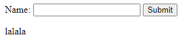

# Jobsheet 5 : PHP Part 2

**Nama :** Lavina<br>
**NIM :** 2342760062<br>
**Kelas :** SIB 2D<br>

### **Praktikum 1. Indexed Arrays**

`array_1.php`

```php
<!DOCTYPE html>
<html lang="en">

<body>
  <h2>Array Terindeks</h2>
  <?php
  $ListDosen = ["Elok Nur Hamdana", "Unggul Pamenang", "Bagas Nugraha"];

  echo $ListDosen[2] . "<br>";
  echo $ListDosen[0] . "<br>";
  echo $ListDosen[1] . "<br>";
  ?>
</body>
</html>
```

**Hasil Percobaan**<br>
<br>

**Pertanyaan 1:** Untuk menampilkan array, selain menggunakan indeks, kita juga bisa menggunakan loop. Coba tampilkan output program di atas menggunakan loop. <br>

`array_1.php`

```php
<!DOCTYPE html>
<html lang="en">

<body>
  <h2>Array Terindeks</h2>
  <?php
  $ListDosen = ["Elok Nur Hamdana", "Unggul Pamenang", "Bagas Nugraha"];

  foreach ($ListDosen as $Dosen) {
    echo $Dosen . "<br>";
  }
  ?>
</body>
</html>
```

Untuk menampilkan isi array bisa menggunakan loop foreach.

### **Praktikum 2. Associative Array**

`array_2.php`

```php
<!DOCTYPE html>
<html lang="en">

<head>
  <meta charset="UTF-8">
  <meta name="viewport" content="width=device-width, initial-scale=1.0">
  <title></title>
</head>

<body>
  <?php
  $Dosen = [
    'nama' => 'Elok Nur Hamdana',
    'domisili' => 'Malang',
    'jenis_kelamin' => 'Perempuan',
  ];

  echo "Nama: $Dosen[nama]<br>";
  echo "Domisili: $Dosen[domisili]<br>";
  echo "Jenis Kelamin: $Dosen[jenis_kelamin]<br>";
  ?>
</body>

</html>
```

**Hasil Percobaan**<br>
<br>

**Pertanyaan 2:** Amati hasil yang ditampilkan. Kemudian tambahkan style tabel pada output tampilan tersebut supaya lebih menarik. <br>

`array_2.php`

```php
<!DOCTYPE html>
<html lang="en">

<head>
  <meta charset="UTF-8">
  <meta name="viewport" content="width=device-width, initial-scale=1.0">
  <title>Data Dosen</title>
  <style>
    body {
      font-family: Arial, sans-serif;
      background-color: #f0f0f0;
      display: flex;
      justify-content: center;
      align-items: center;
      height: 100vh;
      margin: 0;
    }

    .container {
      background-color: white;
      padding: 20px;
      border-radius: 10px;
      box-shadow: 0 4px 8px rgba(0, 0, 0, 0.1);
      max-width: 400px;
      width: 100%;
    }

    h1 {
      text-align: center;
      font-size: 24px;
      color: #333;
      margin-bottom: 20px;
    }

    p {
      font-size: 18px;
      color: #555;
      margin: 10px 0;
    }

    p span {
      font-weight: bold;
    }
  </style>
</head>

<body>
  <div class="container">
    <h1>Data Dosen</h1>
    <?php
    $Dosen = [
      'nama' => 'Elok Nur Hamdana',
      'domisili' => 'Malang',
      'jenis_kelamin' => 'Perempuan',
    ];

    echo "<p><span>Nama:</span> $Dosen[nama]</p>";
    echo "<p><span>Domisili:</span> $Dosen[domisili]</p>";
    echo "<p><span>Jenis Kelamin:</span> $Dosen[jenis_kelamin]</p>";
    ?>
  </div>
</body>
</html>
```

**Hasil Percobaan**<br>
<br>

### **Praktikum 3. Multidimensional Array**

`array_3.php`

```php
<!DOCTYPE html>
<html lang="en">

<head>
  <link rel="stylesheet" type="text/css" href="style.css">
</head>

<body>
  <h2>Multidimensional Array</h2>
  <table>
    <tr>
      <th>Judul Film</th>
      <th>Tahun</th>
      <th>Rating</th>
    </tr>

    <?php
    $movie = array(
      array("Interstellar", "2014", "9.3"),
      array("The Dark Knight", "2008", "9.0"),
      array("The Godfather", "1972", "9.2"),
      array("Pulp Fiction", "1994", "8.9"),
    );
    echo "<tr>";
    echo "<td>" . $movie[0][0] . "</td>";
    echo "<td>" . $movie[0][1] . "</td>";
    echo "<td>" . $movie[0][2] . "</td>";
    echo "</tr>";

    echo "<tr>";
    echo "<td>" . $movie[1][0] . "</td>";
    echo "<td>" . $movie[1][1] . "</td>";
    echo "<td>" . $movie[1][2] . "</td>";
    echo "</tr>";

    echo "<tr>";
    echo "<td>" . $movie[2][0] . "</td>";
    echo "<td>" . $movie[2][1] . "</td>";
    echo "<td>" . $movie[2][2] . "</td>";
    echo "</tr>";

    echo "<tr>";
    echo "<td>" . $movie[3][0] . "</td>";
    echo "<td>" . $movie[3][1] . "</td>";
    echo "<td>" . $movie[3][2] . "</td>";
    echo "</tr>"
    ?>
  </table>
</body>
</html>
```

**Hasil Percobaan**<br>
<br>

**Pertanyaan 3:** Amati output yang ditampilkan dan jelaskan hasil pengamatanmu<br>

Percobaan diatas menunjukkan bagaimana menampilkan array multidimensional yang berisi nama film, tahun, dan ratingnya. Kemudian terdapat tambahan style tabel pada output tampilan tersebut supaya lebih menarik.

### **Praktikum 4. Fungsi**

**Fungsi tanpa Parameter**<br>
`function.php`

```php
<?php
function perkenalan()
{
  echo "Assalamualaikum, ";
  echo "Perkenalkan, nama saya Lavina<br>";
  echo "Senang berkenalan dengan Anda<br>";
}

perkenalan();
```

**Hasil Percobaan**<br>
<br>

**Pertanyaan 4:** Simpan file dan jalankan kodenya. Ubah program sehingga dapat menampilkan output dua kali. Jelaskan pengamatan Kita! <br>

`function.php`

```php
perkenalan();
perkenalan();
```

Jika ingin menampilkan output dua kali, kita hanya perlu memanggil fungsinya dua kali.<br>

**Fungsi dengan Parameter**<br>
`function.php`

```php
<?php
function perkenalan($nama, $salam)
{
  echo $salam . ", ";
  echo "Perkenalkan, nama saya " . $nama . "<br>";
  echo "Senang berkenalan dengan Anda<br>";
}

perkenalan("Lavina", "Assalamualaikum");
echo "<hr>";

$saya = "Mima";
$ucapanSalam = "Selamat pagi";
perkenalan($saya, $ucapanSalam);
```

**Hasil Percobaan**<br>  
<br>

**Pertanyaan 5:** Amati output yang ditampilkan dan jelaskan hasil pengamatanmu! <br>

Percobaan diatas menunjukkan bagaimana cara menampilkan output dari fungsi berparameter. Parameter yang digunakan adalah nama dan salam, parameter ini bisa juga disimpan dalam variabel lalu digunakan di dalam fungsi. <br>

**Fungsi dengan Parameter dan menggunakan nilai default**<br>
`function.php`

```php
<?php
function perkenalan($nama, $salam = "Assalamualaikum")
{
  echo $salam . ", ";
  echo "Perkenalkan, nama saya " . $nama . "<br>";
  echo "Senang berkenalan dengan Anda<br>";
}

perkenalan("Lavina", "Hallo");
echo "<hr>";

$saya = "Mima";
$ucapanSalam = "Selamat pagi";
perkenalan($saya);
```

**Hasil Percobaan**<br>
<br>

**Pertanyaan 6:** Amati output yang ditampilkan dan jelaskan hasil pengamatanmu! <br>

Percobaan diatas menunjukkan bagaimana parameter dengan nilai default bisa digunakan ketika kita tidak memberi nilai untuk parameter salam. <br>

**Fungsi dengan nilai pengembalian**<br>
`function_return.php`

```php
<?php
function hitungUmur($thn_lahir, $thn_sekarang)
{
  $umur = $thn_sekarang - $thn_lahir;
  return $umur;
}

echo "Umur saya adalah " . hitungUmur(2004, 2024) . "tahun";
```

**Hasil Percobaan**<br>
<br>

**Pertanyaan 7:** Amati output yang ditampilkan dan jelaskan hasil pengamatanmu! <br>

Percobaan diatas menunjukkan bagaimana sebuah fungsi bisa memproses sebuah data perhitungan umur dan mengirim hasilnya ketika dipanggil. Untuk mengembalikan sebuah nilai, kita gunakan `return` di dalam fungsi.<br>

**Memanggil fungsi di dalam fungsi lain**<br>

`function_return.php`

```php
<?php
function hitungUmur($thn_lahir, $thn_sekarang)
{
  $umur = $thn_sekarang - $thn_lahir;
  return $umur;
}

function perkenalan($nama, $salam = "Assalamualaikum")
{
  echo $salam . ", ";
  echo "Perkenalkan, nama saya " . $nama . "<br>";

  echo "Umur saya adalah " . hitungUmur(2004, 2024) . "tahun<br>";
  echo "Senang berkenalan dengan Anda<br>";
}

perkenalan("Lavina");
```

**Hasil Percobaan**<br>
<br>

**Pertanyaan 8:** Amati output yang ditampilkan dan jelaskan hasil pengamatanmu!<br>

Percobaan diatas menunjukkan jika sebuah fungsi bisa dipanggil dari fungsi lain yang ditunjukkan dengan fungsi hitungUmur yang dipanggil dari fungsi perkenalan.

### **Praktikum 5. Fungsi Rekursif**

`recursive.php`

```php
<?php
function tampilkanHaloDunia()
{
  echo "Halo Dunia<br>";
  tampilkanHaloDunia();
}

tampilkanHaloDunia();
```

**Hasil Percobaan**<br>
<br>

**Pertanyaan 9:** Jika kode program di atas dieksekusi, apa yang akan terjadi dan apa dampaknya dari melakukannya? Silakan bagikan pendapat Kita! <br>

Ketika program diatas dijalankan menampilkan `Halo Dunia` yang tak terhingga karena pada pemanggilan fungsi `tampilkanHaloDunia` tidak diberi batasan. <br>

Untuk menampilkan angka 1 hingga 25, kita dapat dengan mudah menggunakan loop for sebagai berikut: <br>

`recursive.php`

```php
<?php
for ($i = 1; $i <= 25; $i++) {
  echo "Perulangan ke-{$i} <br>";
}
```

**Hasil Percobaan**<br>
<br>

Kita dapat membuat tampilan angka 1 hingga 25 menggunakan fungsi rekursif (tanpa for loop).<br>

`recursive.php`

```php
<?php
function tampilkanAngka(int $jumlah, int $indeks = 1)
{
  echo "Perulangan ke-{$indeks} <br>";

  if ($indeks < $jumlah) {
    tampilkanAngka($jumlah, $indeks + 1);
  }
}

tampilkanAngka(20);
```

**Hasil Percobaan**<br>
<br>

**Pertanyaan 10:** Jalankan kode program di atas dan jelaskan output nya, lalu jelaskan mengapa ia berperilaku seperti itu? <br>

Pada percobaan tersebut menampilkan angka dari 1-25 dengan menggunakan loop for, tapi bisa juga menggunakan fungsi rekursif. Pada fungsi rekursif, parameter `$indeks` akan selalu bertambah satu setiap kali fungsi dipanggil sampai indeksnya melebihi jumlah yang ditentukan (20) maka rekursifnya akan berhenti. <br>

### **Praktikum 6. Menu Multi-Level**

`multi_menu.php`

```php
<?php
$menu = [
  [
    "nama" => "Beranda",
  ],
  [
    "nama" => "Berita",
    "submenu" => [
      [
        "nama" => "Wisata",
        "submenu" => [
          [
            "nama" => "Pantai"
          ],
          [
            "nama" => "Gunung"
          ]
        ]
      ],
      [
        "nama" => "Kuliner"
      ],
      [
        "nama" => "Hiburan"
      ]
    ]
  ],
  [
    "nama" => "Tentang"
  ],
  [
    "nama" => "Kontak"
  ]
];

function tampilkanMenuBertingkat(array $menu)
{
  echo "<ul>";
  foreach ($menu as $key => $item) {
    echo "<li>{$item['nama']}</li>";
  }
  echo "</ul>";
}

tampilkanMenuBertingkat($menu);
```

**Hasil Percobaan**<br>
<br>

**Pertanyaan 11:** Jalankan program di atas dan jelaskan output nya. <br>

Pada percobaan diatas terdapat fungsi yang menerima sebuah array sebagai parameter, yaitu array menu. Pada fungsi tersebut, kita menggunakan foreach untuk menampilkan isi array menu. <br>

**Pertanyaan 12:** Selanjutnya, buat fungsi di atas rekursif dengan memanggil dirinya sendiri ketika item dari menu memiliki atribut subMenu. Ini akan menghasilkan tampilan seperti berikut. <br>

`multi_menu.php`

```php
function tampilkanMenuBertingkat(array $menu)
{
  echo "<ul>";
  foreach ($menu as $key => $item) {
    echo "<li>{$item['nama']}</li>";
    if (isset($item["submenu"])) {
      tampilkanMenuBertingkat($item["submenu"]);
    }
  }
  echo "</ul>";
}

tampilkanMenuBertingkat($menu);
```

**Hasil Percobaan**<br>
<br>

### **Praktikum 7. String**

`string1.php`

```php
<?php
$loremipsum = "Lorem ipsum dolor sit amet consectetur adipisicing elit. Deleniti repellat aperiam ratione molestias nesciunt quos temporibus adipisci, rerum et. Porro sunt eveniet totam esse praesentium eius sapiente animi sint est!";

echo "<p>{$loremipsum}</p>";
echo "Panjang karakter: " . strlen($loremipsum) . "<br>";
echo "Panjang kata: " . str_word_count($loremipsum) . "<br>";
echo "<p>" . strtoupper($loremipsum) . "</p>";
echo "<p>" . strtolower($loremipsum) . "</p>";
```

**Hasil Percobaan**<br>
<br>

**Pertanyaan 13:** Amati output yang ditampilkan dan jelaskan hasil pengamatanmu! <br>

Percobaan diatas menunjukkan beberapa fungsi yang bisa digunakan untuk mengubah string. <br>
`strlen`: Menghitung panjang string <br>
`str_word_count`: Menghitung jumlah kata dalam string <br>
`strtoupper`: Mengubah string menjadi huruf besar <br>
`strtolower`: Mengubah string menjadi huruf kecil <br>

**Escape String**<br>

`string2.php`

```php
<?php

echo "Baris\nbaru <br>";
echo 'Baris\nbaru <br>';
echo "Halo\rDunia <br>";
echo 'Halo\rDunia <br>';

echo "<pre>Halo\tDunia!</pre>";
echo '<pre>Halo\tDunia!</pre>';

echo "Katakanlah \"Tidak pada narkoba!\" <br>";
echo 'Katakanlah \'Tidak pada narkoba!\' <br>';
```

**Hasil Percobaan**<br>
<br>

**Pertanyaan 14:** Dari kode program di atas, Kita dapat mengamati perbedaan antara tanda kutip ganda dan tanda kutip tunggal dalam hal bagaimana mereka menangani string escape. Amati output dan jelaskan hasil dari setiap output . Kesimpulan apa yang dapat Kita tarik dari percobaan ini? <br>

Tanda kutip ganda bisa digunakan untuk karakter escape seperti `\n` dan `\t` serta interpolasi variabel ke dalam string. Sedangkan tanda kutip tunggal tidak bisa melakukan interpretasi karakter escape sehingga akan dianggap sebagai karakter biasa. `<pre>` digunakan untuk menampilkan teks dalam format preformatted atau teks dengan format tetap. Keuntungannya adalah elemen ini mempertahankan spasi dan pemformatan teks yang ada di dalamnya tanpa mengabaikan karakter whitespace seperti spasi dan baris baru. <br>

**Membalikkan String dengan fungsi strrev()**<br>

`string3.php`

```php
<?php

$pesan = "Saya arek Malang";
echo strrev($pesan) . "<br>";
```

**Hasil Percobaan**<br>
<br>

**Pertanyaan 15:** Amati output yang ditampilkan dan jelaskan hasil pengamatanmu! <br>

Percobaan diatas menunjukkan cara membalikkan string dengan menggunakan fungsi `strrev()`.<br>

Untuk membalikkan string kata demi kata, ketik kode program berikut: <br>

`string3.php`

```php
<?php

$pesan = "Saya arek Malang";

$pesanPerKata = explode(" ", $pesan);

$pesanPerkata = array_map(fn($pesan) => strrev($pesan), $pesanPerKata);

$pesan = implode(" ", $pesanPerkata);

echo $pesan . "<br>";
```

**Hasil Percobaan**<br>
<br>

**Pertanyaan 16:** Amati output yang ditampilkan dan jelaskan hasil pengamatanmu! <br>

Pada percobaan diatas dilakukan pengolahan teks dari variabel $pesan menjadi array berisi kata-kata dengan menggunakan fungsi `explode()` dengan spasi sebagai pemisah yang menghasilkan array `$pesanPerKata`. Kemudian dengan fungsi `array_map()`kita menggunakan fungsi anonim untuk membalikkan setiap kata dari array tersebut dengan menggunakan fungsi`strrev()`yang menghasilkan array baru`$pesanPerKata` berisi kata-kata yang dibalikkan. Terakhir, dengan fungsi `implode()` kita menggabungkan array tersebut menjadi string baru `$pesan` dengan menggunakan spasi sebagai pemisah. <br>

### **Praktikum 8. HTML dan PHP**

`index.php`

```php
<html>

<head>
  <title>Cara 1</title>
</head>

<body>
  <p>Tanggal Hari ini : <?php echo date("d M Y"); ?></p>
</body>

</html>

<?php
echo "<html>";
echo "<head>";
echo "<title>Cara 2</title>";
echo "</head>";
echo "<body>";
echo "<p>Tanggal Hari ini : " . date("d M Y") . "</p>";
echo "</body>";
echo "</html>";
?>
```

**Hasil Percobaan**<br>
<br>

**Pertanyaan 17:** Manakah dari dua metode yang menurut Kalian lebih mudah? Berikan jawabanmu bersama dengan alasan. <br>

Metode pertama memiliki sintaks yang lebih mudah dibaca dan mempermudah dalam menambahkan beberapa baris kode di dalamnya.<br>

### **Praktikum 9. Entitas HTML**

`entities.php`

```php
<!DOCTYPE html>
<html lang="en">

<head>
  <title>Entities HTML</title>
</head>

<body>
  <p>It&#39; time to read HTML5 book.</p>
  <p>&nbsp;&nbsp;&nbsp;&nbsp;Keuntungan dari menggunakan nama entities: Sebuah nama entitas mudah diingat. Kerugian dari menggunakan nama entities: Browser mungkin tidak mendukung semua nama entitas, tetapi dukungan untuk nomor lebih baik.</p>
  <p>&#169; 2023 jti.com</p>
</body>

</html>
```

**Hasil Percobaan**<br>
<br>

**Pertanyaan 18:** Amati output yang ditampilkan dan jelaskan hasil pengamatanmu! <br>

Percobaan diatas menunjukkan jika beberapa simbol khusus akan ditranslate ke karakter lain yang telah distandarisasi seperti `&#169;` diubah menjadi ©. `&nbsp;` berguna untuk menambahkan spasi yang tidak dapat diperluas (non-breaking space). Ini berguna ketika ingin memastikan bahwa beberapa spasi atau jarak antara kata-kata tidak dihapus oleh browser. <br>

**Pertanyaan 19:** Bagaimana Kita bisa melihat header HTTP di browser web Kita? Jelaskan dan sertakan langkah-langkahnya. <br>

Caranya dengan membuka inspect element di browser web. Kemudian klik bagian Network dan pilih All. Disana akan muncul semua request yang dilakukan oleh website, pilih salah satunya dan klik pada Headers. Kemudian akan muncul semua informasi header yang dikirim oleh website tersebut. <br>

<br>

### **Praktikum 10. Tanggal**

`date.php`

```php
<!DOCTYPE html>
<html lang="en">

<head>
</head>

<body>
  <h3>Date</h3>
  <?php
  echo "Today is " . date("Y/m/d") . "<br>";
  echo "Today is " . date("Y.m.d") . "<br>";
  echo "Today is " . date("Y-m-d") . "<br>";
  echo "today is " . date("l");
  ?>
</body>

</html>
```

**Hasil Percobaan**<br>
<br>

**Pertanyaan 19:** Amati output yang ditampilkan dan jelaskan hasil pengamatanmu! <br>

Pada percobaan diatas menampilkan tanggal dan waktu dengan menggunakan fungsi `date(format, timestamp)` yang mana parameter pertama wajib dan yang kedua opsional. <br>

`time.php`

```php
<!DOCTYPE html>
<html lang="en">

<head></head>

<body>
  <h3>Time</h3>
  <?php
  date_default_timezone_set("asia/jakarta");
  echo date("h:i:sa");
  ?>
</body>

</html>
```

**Hasil Percobaan**<br>
<br>

**Pertanyaan 20:** Amati output yang ditampilkan dan jelaskan hasil pengamatanmu! <br>

Percobaan diatas menggunakan fungsi `date_default_timezone_set()` untuk mengatur zona waktu yang diinginkan.<br>

### **Praktikum 11. Variabel Superglobal**

**$\_SEREVR**<br>
`global_server.php`

```php
<?php
echo '<pra>';
print_r($_SERVER);
echo '</pra>';
```

**Hasil Percobaan**<br>
<br>

**Pertanyaan 22:** Jalankan kode program di atas, lalu jelaskan output dari setiap perintah echo. <br>

`<pra>` adalah tag yang digunakan untuk menandai bagian dari output yang akan dikirim ke browser. Perintah `print_r()` digunakan untuk menampilkan isi variabel `$_SERVER` dalam bentuk array.<br>

**$\_GET**<br>
`global_get.php`

```php
<?php

$nama = @$_GET["nama"];

$usia = @$_GET["usia"];

echo "Halo {$nama}! Apakah benar anda berusia {$usia} tahun?<br>";
```

**Hasil Percobaan**<br>
<br>

**Pertanyaan 23:** Jalankan url ini di browser Kita
`localhost/dasarWeb/JS05_PHP-2/global_get.php?nama=Elok&usia=37`
Output apa yang dihasilkan, amati, dan jelaskan hasilnya. <br>

<br>

Ketika diisi parameter nama dan usia, di urlnya maka akan muncul pada outputnya karena isinya diambil dengan`$_GET`. <br>

**$\_POST**<br>
`global_post.php`

```php
<html>

<body>
  <form action="<?php echo $_SERVER['PHP_SELF']; ?>" method="post">
    Name: <input type="text" name="fnama">
    <input type="submit">
  </form>

  <?php
  if ($_SERVER['REQUEST_METHOD'] == 'POST') {
    $name = $_POST['fnama'];
    if (empty($name)) {
      echo "Name is empty";
    } else {
      echo $name;
    }
  }
  ?>
</body>

</html>
```

**Hasil Percobaan**<br>
<br>
<br>

**Pertanyaan 24:** Kirim formulir dan output apa yang dihasilkan? Amati dan jelaskan hasilnya. <br>

Percobaan diatas menunjukkan cara implementasi form dengan method `POST`. Berikut alur kodenya : <br>

- Form menggunakan method `POST` dan mengirimkan data ke halaman yang sama (`action="<?php echo $_SERVER['PHP_SELF']; ?>"`). <br>
- Input teks dengan name="fnama" sebagai tempat input nama. <br>
- Ketika tombol submit diklik, data dikirim ke server. <br>
- Setelah submit akan ada pengecekan `$_SERVER['REQUEST_METHOD'] == 'POST'`. untuk mengecek apakah data dikirim dengan method `POST`. <br>
- Lalu kode akan mengambil nilai input dengan $\_POST['fnama']. <br>
- Jika nama kosong, akan menampilkan "Name is empty". Jika ada isinya, akan mencetak nilai nama yang dimasukkan. <br>

**$\_REQUEST**<br>
`global_request.php`

```php
<html>

<body>
  <form action="<?php echo $_SERVER['PHP_SELF']; ?>" method="post">
    Name: <input type="text" name="fnama">
    <input type="submit">
  </form>

  <?php
  if ($_SERVER['REQUEST_METHOD'] == 'POST') {
    $name = $_REQUEST['fnama'];

    if (empty($name)) {
      echo "Name is empty";
    } else {
      echo $name;
    }
  }
  ?>
</body>

</html>
```

**Hasil Percobaan**<br>
<br>
<br>

**Pertanyaan 25:** Kirim formulir dan output apa yang dihasilkan? Amati dan jelaskan hasilnya. Dan apa bedanya dengan variabel global $\_POST? <br>

Penggunaan `$_REQUEST` bisa menangkap data dari GET, POST, atau cookie, sehingga lebih fleksibel, tapi bisa menyebabkan ambiguitas jika ada data dengan nama yang sama di metode berbeda.<br>

**$GLOBALS**<br>

`global_globals.php`

```php
<?php
$x = 75;
$y = 25;

function addition()
{
  $GLOBALS['z'] = $GLOBALS['x'] + $GLOBALS['y'];
}

addition();
echo $z;
```

**Hasil Percobaan**<br>
<br>

**Pertanyaan 26:** Kirim formulir dan output apa yang dihasilkan? Amati dan jelaskan hasilnya. <br>

Percobaan diatas mendefinisikan variabel global dengan nama `$z` dan menambahkan nilai dari variabel `$x` dan `$y` di fungsi `addition()`. Varibael $GLOBALS digunakan untuk mengambil nilai variabel meskipun digunakan pada scope yang berbeda, karena itu variabel `$z` bisa diakses diluar if.
