# Jobsheet 6 : jQuery dan AJAX

**Nama :** Lavina<br>
**NIM :** 2342760062<br>
**Kelas :** SIB 2D<br>

### **Praktikum Bagian 1. Persiapan Menggunakan JQuery**

**Hasil Percobaan**<br>
<br>

**Mengakses Jquery secara lokal**

```html
<!DOCTYPE html>
<html>
  <head>
    <title>Praktikum JQuery</title>
    <script src="jquery-3.7.1.js"></script>
  </head>
  <body></body>
</html>
```

**Mengakses Jquery dengan CDN** <br>

Google CDN

````html
<!DOCTYPE html>
<html>
  <head>
    <script src="https://ajax.googleapis.com/ajax/libs/jquery/3.7.1/jquery.min.js"></script>
  </head>
</html>

Microsoft CDN ```html
<!DOCTYPE html>
<html>
  <head>
    <script src="https://ajax.aspnetcdn.com/ajax/jQuery/jquery-3.7.1.min.js"></script>
  </head>
</html>
````

### **Praktikum Bagian 2. Fungsi Document Ready**

`jquery.html`

```html
<!DOCTYPE html>
<html lang="en">
  <head>
    <script type="text/javascript" src="jquery-3.7.1.js"></script>
    <script>
      $(document).ready(function () {
        $("#button1").click(function () {
          alert("Ini praktikum minggu ke-4");
        });
      });
    </script>
  </head>
  <body>
    <input type="button" id="button1" value="Klik Saya !" />
  </body>
</html>
```

**Hasil Percobaan**<br>
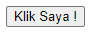<br>
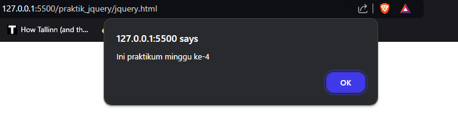<br>

`jquery.html`

```html
<!DOCTYPE html>
<html lang="en">
  <head>
    <script type="text/javascript" src="jquery-3.7.1.js"></script>
    <script>
      $("#button1").click(function () {
        alert("Ini praktikum minggu ke-4");
      });
    </script>
  </head>
  <body>
    <input type="button" id="button1" value="Klik Saya !" />
  </body>
</html>
```

**Pertanyaan 1:** Dari hasil pengamatan Anda, apa yang anda pahami dari fungsi document ready()? Catat hasil pengamatan dan penjelasan dari pemahaman Anda di bawah ini <br>

Ketika fungsi itu dihapus, tombolnya tidak menampilkan alert sesuai karena fungsi itu bergantung pada elemen DOM sedangkan untuk memastikan elemen DOM sudah dimuat harus menggunakan fungsi ready().

### **Praktikum Bagian 3. Selector**

`selector.html`

```html
<!DOCTYPE html>
<html lang="en">
  <head>
    <script type="text/javascript" src="jquery-3.7.1.js"></script>
    <script>
      $(document).ready(function () {
        $("button").click(function () {
          $("h2").hide();
          $(".subjudul").hide();
          $("#paragraf").hide();
          $("#paragraf.dua").hide();
          $("div p.paragraf").hide();
        });
      });
    </script>
  </head>
  <body>
    <h2>Ini adalah judul bab</h2>
    <h3 class="subjudul">Ini adalah sub judul bab</h3>
    <p id="paragraf">Ini adalah paragraf pertama</p>
    <p id="paragraf" class="dua">Ini adalah paragraf kedua</p>
    <div>
      <p class="paragraf">Ini adalah paragraf ketiga</p>
    </div>
    <p>Ini adalah paragraf yang akan ditampilkan</p>
    <button>Klik saya!</button>
  </body>
</html>
```

**Hasil Percobaan**<br>
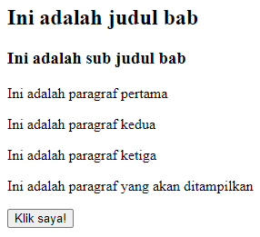<br>
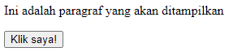

**Pertanyaan 2:** Catat dan jelaskan hasil pengamatan Anda setelah menjalankan kode program diatas.<br>

Kode diatas menggunakan fungsi hide() untuk menyembunyikan elemen DOM yang ditentukan dengan selector ketika button diklik. <br>

**Pertanyaan 3:** Di dalam kode program pada langkah nomor 1, terdapat beberapa penulisan jQuery selector. Tuliskan dan jelaskan apa saja jQuery Selector yang terdapat dalam kode program. <br>

Penulisan selector `.` adalah selector untuk elemen class, selector `#` adalah selector id. Kita juga bisa langsung melakukan selector terhadap tag nya seperti `h2`, `p`, `div`, `button`, dan lain sebagainya. Kita juga bisa memadukan beberapa selector bersama seperti `div p.paragraf` agar bisa mendapatkan elemen yg spesifik. <br>

### **Praktikum Bagian 4. Events**

`events.html`

```html
<!DOCTYPE html>
<html lang="en">
  <head>
    <style>
      #paragraf {
        width: 600px;
        height: 80px;
        background-color: pink;
        line-height: 80px;
        text-align: center;
        font-size: 30px;
      }
    </style>
    <script type="text/javascript" src="jquery-3.7.1.js"></script>
    <script>
      $(document).ready(function () {
        $("#paragraf").click(function () {
          $("#paragraf").css("color", "white");
        });

        $("#paragraf").mouseover(function () {
          $("#paragraf").css("background-color", "silver");
        });

        $("#paragraf").mouseout(function () {
          $("#paragraf").css("background-color", "blue");
        });

        $("#paragraf").dblclick(function () {
          $("#paragraf").css("border", "solid 3px black");
        });
      });
    </script>
  </head>
  <body>
    <p id="paragraf">Praktikum minggu ke-4 jQuery</p>
  </body>
</html>
```

**Hasil Percobaan**<br>
Normal<br>
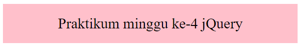<br>

Mouse Over<br>
<br>

Mouse Out<br>
<br>

Double Click<br>
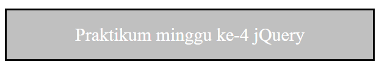<br>

**Pertanyaan 4:** Catat dan jelaskan perubahan yang terjadi berdasarkan hasil pengamatan Anda <br>

Pada kode diatas kita melakukan manipulasi style CSS pada elemen DOM yang ditentukan dengan selector `#paragraf` dengan menggunakan fungsi `css()`. Manipulasinya dilakukan sesuai dengan event yang terjadi, yaitu click() ketika diklik, mouse over() ketika mouse berada diatas elemen, mouse out() ketika mouse keluar dari elemen, dan dblclick() ketika elemen diklik dua kali. <br>

### **Praktikum 5. Effect Hide dan Show**

`effect.html`

```html
<!DOCTYPE html>
<html lang="en">
  <head>
    <link rel="stylesheet" type="text/css" href="style.css" />
    <script type="text/javascript" src="jquery-3.7.1.js"></script>
    <script>
      $(document).ready(function () {
        $(".tombol1").click(function () {
          $("div").hide();
        });

        $(".tombol2").click(function () {
          $("div").show();
        });

        $(".tombol3").click(function () {
          $("#div1").fadeOut();
          $("#div2").fadeOut("slow");
          $("#div3").fadeOut("3000");
        });

        $(".tombol4").click(function () {
          $("#div1").fadeIn();
          $("#div2").fadeIn("slow");
          $("#div3").fadeIn("3000");
        });

        $(".tombol5").click(function () {
          $("#div1").fadeTo("slow", 0.15);
          $("#div2").fadeTo("slow", 0.4);
          $("#div3").fadeTo("slow", 0.7);
        });
      });
    </script>
  </head>
  <body>
    <p>jQuery Effect</p>
    <div id="div1" class="kotak"></div>
    <br /><br />
    <div id="div2" class="kotak"></div>
    <br /><br />
    <div id="div3" class="kotak"></div>
    <br /><br />
    <button class="tombol1">Sembunyikan</button>
    <button class="tombol2">Tampilkan</button>
    <button class="tombol3">Fade Out</button>
    <button class="tombol4">Fade In</button>
    <button class="tombol5">Fade To</button>
  </body>
</html>
```

`style.css`

```css
.kotak {
  width: 80px;
  height: 80px;
}

#div1 {
  background-color: red;
}

#div2 {
  background-color: green;
}

#div3 {
  background-color: blue;
}
```

**Hasil Percobaan**<br>
Normal<br>
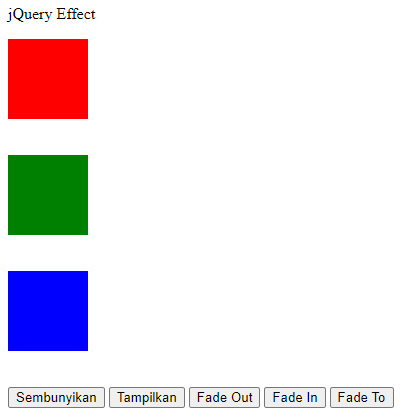<br>

Ketika tombol `Sembunyikan` diklik<br>
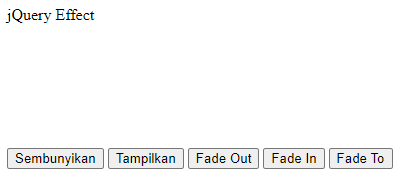<br>

Ketika tombol `Tampilkan` diklik<br>
<br>

Ketika tombol `Fade Out` diklik<br>
Hasilnya kotak akan memudar secara perlahan dan menghilang<br>

Ketika tombol `Fade In` diklik<br>
Hasilnya kotak akan perlahan muncul<br>

Ketika tombol `Fade To` diklik<br>
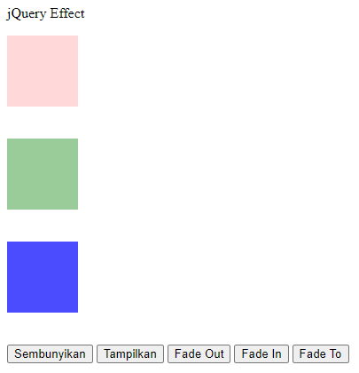<br>

**Pertanyaan 5:** Catat dan jelaskan perubahan yang terjadi berdasarkan hasil pengamatan Anda <br>

Pada kode diatas kita melakukan manipulasi style CSS pada elemen DOM yang ditentukan dengan selector `#div1` sampai `div3` dan memberikannya efek menggunakan fungsi `fadeOut()` untuk menghilangkan elemen secara perlahan, `fadeIn()` untuk menampilkan elemen secara perlahan, dan `fadeTo()` untuk mengubah elemen secara perlahan dengan nilai yang ditentukan. <br>

### **Praktikum 6. Effect Slide**

**slideUp()**<br>

`effectSlide.html`

```html
<!DOCTYPE html>
<html lang="en">
  <head>
    <link rel="stylesheet" type="text/css" href="styleSlide.css" />
    <script type="text/javascript" src="jquery-3.7.1.js"></script>
    <script>
      $(document).ready(function () {
        $("#flip").click(function () {
          $("#kotak2").slideUp("slow");
        });
      });
    </script>
  </head>
  <body>
    <div id="flip">Klik untuk efek slide!</div>
    <div id="kotak2">Selamat Pagi</div>
  </body>
</html>
```

`styleSlide.css`

```css
#kotak2,
#flip {
  padding: 5px;
  text-align: center;
  background-color: #a7dbd8;
  border: solid 2px #e0e4cc;
  border-radius: 5px;
}

#kotak2 {
  padding: 50px;
}
```

**Hasil Percobaan**<br>
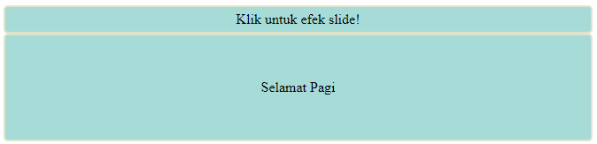<br>
Setelah diklik kotak yang dibawah tergeser keatas secara perlahan lalu menghilang. <br>
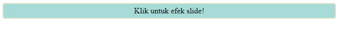<br>

**Pertanyaan 6:** Catat dan jelaskan perubahan yang terjadi berdasarkan hasil pengamatan Anda <br>

Pada kode diatas kita melakukan manipulasi style CSS pada elemen DOM yang ditentukan dengan selector `#kotak2` dan `#flip` dengan menggunakan fungsi `slideUp()` untuk menggeser elemen keatas secara perlahan sampai tidak nampak lagi. <br>

**slideDown()**<br>

`effectSlide.html`

```html
<!DOCTYPE html>
<html lang="en">
  <head>
    <link rel="stylesheet" type="text/css" href="styleSlide.css" />
    <script type="text/javascript" src="jquery-3.7.1.js"></script>
    <script>
      $(document).ready(function () {
        $("#flip").click(function () {
          $("#kotak2").slideDown("slow");
        });
      });
    </script>
  </head>
  <body>
    <div id="flip">Klik untuk efek slide!</div>
    <div id="kotak2">Selamat Pagi</div>
  </body>
</html>
```

**Pertanyaan 7:** Catat dan jelaskan perubahan yang terjadi berdasarkan hasil pengamatan Anda <br>

Pada kode diatas kita menggunakan fungsi `slideDown()` untuk memberi efek menggeser elemen ke bawah secara perlahan sampai tidak nampak lagi. <br>

**slideToggle()**<br>

`effectSlide.html`

```html
<!DOCTYPE html>
<html lang="en">
  <head>
    <link rel="stylesheet" type="text/css" href="styleSlide.css" />
    <script type="text/javascript" src="jquery-3.7.1.js"></script>
    <script>
      $(document).ready(function () {
        $("#flip").click(function () {
          $("#kotak2").slideToggle("slow");
        });
      });
    </script>
  </head>
  <body>
    <div id="flip">Klik untuk efek slide!</div>
    <div id="kotak2">Selamat Pagi</div>
  </body>
</html>
```

**Pertanyaan 8:** Catat dan jelaskan perubahan yang terjadi berdasarkan hasil pengamatan Anda <br>

Kode diatas menggunakan fungsi `slideToggle()` untuk memberi efek menggeser elemen sesuai dengan visibilitasnya, jika elemen tersebut terlihat, maka akan menggeser elemen ke atas secara perlahan, jika tidak terlihat maka akan menggeser elemen ke bawah secara perlahan.<br>

### **Praktikum 7. Animasi**

**Method Animate()**<br>
`animasi.html`

```html
<!DOCTYPE html>
<html lang="en">
  <head>
    <link rel="stylesheet" type="text/css" href="styleAnimate.css" />
    <script type="text/javascript" src="jquery-3.7.1.js"></script>
    <script>
      $(document).ready(function () {
        $("button").click(function () {
          $("div").animate({ left: 300 });
        });
      });
    </script>
  </head>
  <body>
    <button type="button">Start Animation</button>
    <div class="box"></div>
  </body>
</html>
```

`styleAnimate.css`

```css
.box {
  width: 100px;
  height: 100px;
  background: #9d7ede;
  margin-top: 30px;
  border-style: solid;
  border-color: #6f40ce;
  position: relative;
}
```

**Hasil Percobaan**<br>
Normal<br>
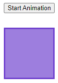<br>

Setelah diklik tombol `Start Animation`<br>
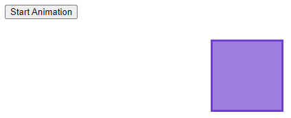<br>

**Pertanyaan 9:** Catat dan jelaskan perubahan yang terjadi berdasarkan hasil pengamatan Anda <br>

Kode diatas memeberikan animasi pada elemen DOM dengan selector `.box` dengan menggunakan fungsi `animate()` sehingga kotak tergeser elemen ke kiri. <br>

**Method Chaining**<br>

`animasi2.html`

```html
<!DOCTYPE html>
<html lang="en">
  <head>
    <link rel="stylesheet" type="text/css" href="styleAnimate.css" />
    <script type="text/javascript" src="jquery-3.7.1.js"></script>
    <script>
      $(document).ready(function () {
        $("button").click(function () {
          $(".box")
            .animate({ width: "300px" })
            .animate({ height: "300px" })
            .animate({ marginLeft: "150px" })
            .animate({ borderWidth: "10px" })
            .animate({ opacity: 0.5 });
        });
      });
    </script>
  </head>
  <body>
    <button type="button">Start Animation</button>
    <div class="box"></div>
  </body>
</html>
```

**Hasil Percobaan**<br>
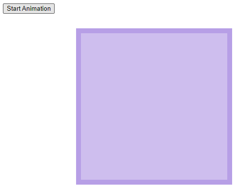<br>

**Pertanyaan 10:** Catat dan jelaskan perubahan yang terjadi berdasarkan hasil pengamatan Anda <br>

Pada kode diatas animasinya dilakukan satu persatu, bentuk kotaknya berubah ubah sesuai dengan style css yang ditentukan.<br>

### **Praktikum 8. JQuery DOM Manipulation**

**Mengambil (GET) Konten dari Elemen HTML**<br>

`dom.html`

```html
<!DOCTYPE html>
<html lang="en">
  <head>
    <script type="text/javascript" src="jquery-3.7.1.js"></script>
    <script>
      $(document).ready(function () {
        $("#btn1").click(function () {
          alert($("#test1").text());
        });

        $("#btn2").click(function () {
          alert($("#test2").html());
        });

        $("#btn3").click(function () {
          alert($("#test3").val());
        });
      });
    </script>
  </head>
  <body>
    <p id="test1">This is the first paragraph.</p>
    <p id="test2">This is <b> another </b> paragraph.</p>

    <p>Your name: <input type="text" id="test3" /></p>

    <button id="btn1">Get Text</button>
    <button id="btn2">Get HTML</button>
    <button id="btn3">Get Value</button>
  </body>
</html>
```

**Hasil Percobaan**<br>
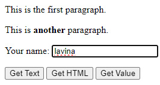<br>
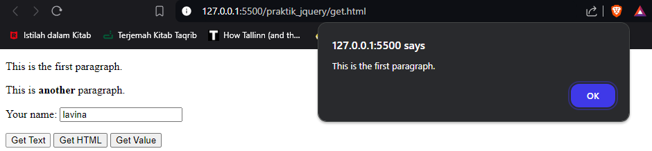<br>
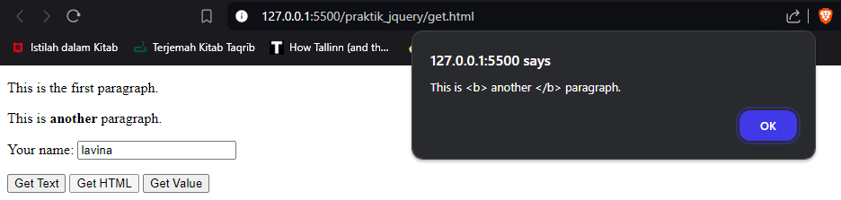<br>
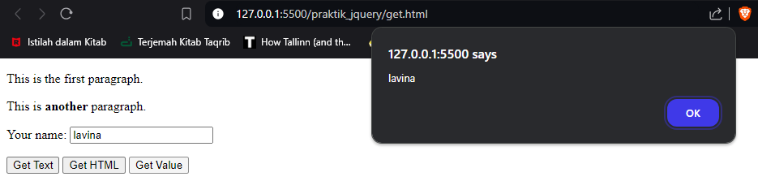<br>

**Pertanyaan 11:** Catat dan jelaskan perubahan yang terjadi berdasarkan hasil pengamatan Anda <br>

Pada kode diatas, ketika tombol `Get Text` diklik, maka akan menampilkan teks dari tag `p` dengan id `test1`. Ketika tombol `Get HTML` diklik, maka akan menampilkan tag HTML dan isinya dari tag `p` dengan id `test2`. Ketika tombol `Get Value` diklik, maka akan menampilkan nilai yg diinputkan dari tag `p` dengan id `test3`. <br>

**Mengubah (SET) Konten dari Elemen HTML**<br>

`dom.html`

```html
<!DOCTYPE html>
<html lang="en">
  <head>
    <script type="text/javascript" src="jquery-3.7.1.js"></script>
    <script>
      $(document).ready(function () {
        $("#btn1").click(function () {
          alert($("#test1").text("<b>Hello World</b>"));
        });

        $("#btn2").click(function () {
          alert($("#test2").html("<b>Hello World</b>"));
        });

        $("#btn3").click(function () {
          alert($("#test3").val("Polinema"));
        });
      });
    </script>
  </head>
  <body>
    <p id="test1">This is the first paragraph.</p>
    <p id="test2">This is <b> another </b> paragraph.</p>

    <p>Your name: <input type="text" id="test3" /></p>

    <button id="btn1">Get Text</button>
    <button id="btn2">Get HTML</button>
    <button id="btn3">Get Value</button>
  </body>
</html>
```

**Hasil Percobaan**<br>
Ketika semua tombol diklik, hasilnya: <br>
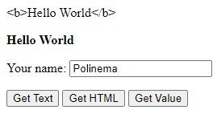<br>

**Pertanyaan 12:** Catat hasil pengamatan Anda dan jelaskan perbedaan method set `text()`, `html()`, dan `val()` <br>

`text()`: Berfungsi untuk memanipulasi isi text isi dari elemen html yang ditentukan. <br>
`html()`: Berfungsi untuk memanipulasi isi dari elemen yang ditentukan lengkap dengan tag HTML. <br>
`val()`: Berfungsi untuk mengubah isi nilai dari input yang ditentukan.<br>

**Menambah dan Menghapus Konten dari Elemen HTML**<br>

`styleTable.html`

```css
form {
  margin: 20px 0;
}

form input,
button {
  padding: 5px;
}

table {
  width: 100%;
  margin-bottom: 20px;
  border-collapse: collapse;
}

table,
th,
td {
  border: 1px solid #cdcdcd;
}

table th,
table td {
  padding: 10px;
  text-align: left;
}
```

`dom2.html`

```html
<!DOCTYPE html>
<html lang="en">
  <head>
    <link rel="stylesheet" type="text/css" href="styleTable.css" />
    <script type="text/javascript" src="jquery-3.7.1.js"></script>
    <script>
      $(document).ready(function () {
        $(".add-row").click(function () {
          var name = $("#name").val();
          var email = $("#email").val();
          var markup =
            "<tr><td><input type='checkbox' name='record' /></td><td>" +
            name +
            "</td><td>" +
            email +
            "</td></tr>";
          $("table tbody").append(markup);
        });
        $(".delete-row").click(function () {
          $("table tbody")
            .find("input[name='record']")
            .each(function () {
              if ($(this).is(":checked")) {
                $(this).parent("tr").remove();
              }
            });
        });
      });
    </script>
  </head>
  <body>
    <form action="">
      <input type="text" id="name" placeholder="Name" />
      <input type="text" id="email" placeholder="Email Address" />
      <input type="button" class="add-row" value="Add Row" />
    </form>
    <table>
      <thead>
        <tr>
          <th>Select</th>
          <th>Name</th>
          <th>Email</th>
        </tr>
      </thead>
      <tbody>
        <tr>
          <td><input type="checkbox" name="record" /></td>
          <td>Tony Stark</td>
          <td>tonystark@gmail.com</td>
        </tr>
      </tbody>
    </table>
    <button type="button" class="delete-row">Delete Row</button>
  </body>
</html>
```

**Hasil Percobaan**<br>
Menambahkan baris <br>
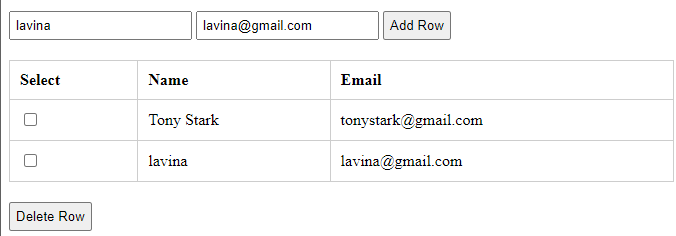<br>

Mengapus baris<br>
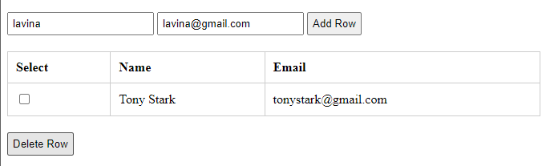<br>

**Pertanyaan 13:** Catat dan jelaskan hasil pengamatan Anda <br>

Kode diatas berguna untuk menambahkan dan menghapus baris dari tabel, alurnya yaitu : <br>
Menambahkan baris <br>

- Ketika tombol dengan class `.add-row` diklik, nilai dari input teks dengan id `#name` dan `#email` diambil. <br>
- Kode membuat markup HTML untuk baris baru (<tr>) berisi kotak centang dan nilai input. <br>
- Baris tersebut kemudian ditambahkan ke dalam tabel `<table tbody>` dengan funsi `.append()`. <br>

Mengapus baris<br>

- Ketika tombol dengan class `.delete-row` diklik, setiap kotak centang di dalam tabel diperiksa.<br>
- Jika kotak centang terpilih (`:checked`), baris tempat kotak centang tersebut berada (`<tr>`) akan dihapus.<br>

### **Praktikum 9. JQuery Manipulasi CSS**

`cssManipulation.html`

```html
<!DOCTYPE html>
<html lang="en">
  <head>
    <link rel="stylesheet" type="text/css" href="styleCSS.css" />
    <script type="text/javascript" src="jquery-3.7.1.js"></script>
    <script>
      $(document).ready(function () {
        $(".btn1").click(function () {
          $("h1, h2, p").addClass("blue");
          $("div").addClass("important");
        });
        $(".btn2").click(function () {
          $("h1, h2, p").removeClass("blue");
        });
        $(".btn3").click(function () {
          $("h1, h2, p, div").css(
            "background-color",
            "yellow",
            "font-size",
            "100%"
          );
        });
      });
    </script>
  </head>
  <body>
    <h1>Heading 1</h1>
    <h2>Heading 2</h2>
    <p>This is a paragraph.</p>
    <p>This is another paragraph.</p>
    <div>This is some important text.</div>

    <button class="btn1">Add classes to elements</button>
    <button class="btn2">Remove classes from elements</button>
    <button class="btn3">Set classes to elements</button>
  </body>
</html>
```

`styleCSS.css`

```css
.important {
  font-weight: bold;
  font-size: xx-large;
}

.blue {
  color: blue;
}
```

**Hasil Percobaan**<br>
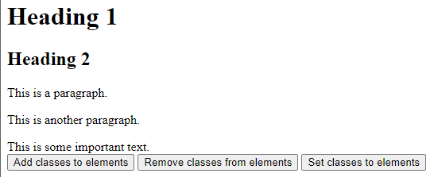<br>
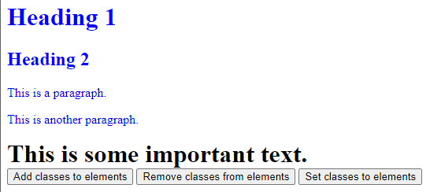<br>
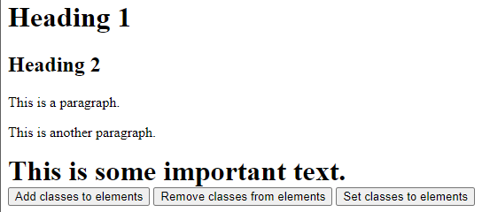<br>
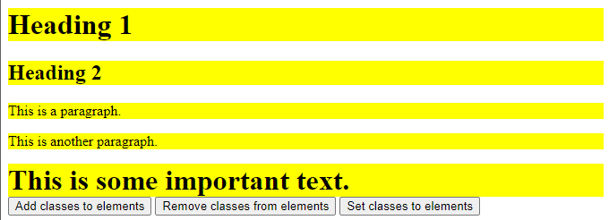<br>

**Pertanyaan 14:** Catat dan jelaskan hasil pengamatan Anda <br>

Kode diatas bisa mengubah style CSS pada elemn HTML saat tombol-tombol diklik. Pada tombol `Add classes to elements`, elemen HTML akan menambahkan class `blue` dan `important` ke elemen `h1`, `h2`, `p`, dan `div`. Pada tombol `Remove classes from elements`, elemen HTML akan menghapus class `blue` dari elemen `h1`, `h2`, `p`, dan `div`. Pada tombol `Set classes to elements`, elemen HTML mendapatkan styling tambahan seperti background color `yellow` dan font size `100%`.<br>

### **Praktikum 10. Membuat Slide Show**

`slideShow.html`

```html
<!DOCTYPE html>
<html lang="en">
  <head>
    <script type="text/javascript" src="jquery-3.7.1.js"></script>
    <script>
      var i = 0;
      $(document).ready(function () {
        $(".slidertitle, #slider img").hide();
        showNextImage();
        setInterval("showNextImage()", 3000);
      });
      function showNextImage() {
        i++;
        $("#sliderImage" + i)
          .appendTo("#slider")
          .fadeIn(1100)
          .delay(1100)
          .fadeOut(1100);
        $("#title" + i)
          .appendTo("#slider")
          .fadeIn(1100)
          .delay(1100)
          .fadeOut(1100);
        if (i == 3) {
          i = 0;
        }
      }
    </script>
  </head>
  <body>
    <div id="slider">
      
      <div class="slidertitle" id="title1">Gambar 1</div>

      
      <div class="slidertitle" id="title2">Gambar 2</div>

      
      <div class="slidertitle" id="title3">Gambar 3</div>
    </div>
  </body>
</html>
```

`styleSlideShow.css`

```css
#slider {
  padding: 10px 0 10px;
  position: relative;
  width: 300px;
  height: 300px;
}

#slider img {
  width: 300px;
  height: 300px;
  position: absolute;
  -webkit-border-radius: 5px 5px 5px 5px;
  border-radius: 5px;
  -moz-border-radius: 5px 5px 5px 5px;
}

.slidertitle {
  width: 280px;
  margin-top: 265px;
  text-align: center;
  position: absolute;
  padding: 10px;
  -webkit-border-radius: 0px 0px 5px 5px;
  border-radius: 0px 0px 5px 5px;
  -moz-border-radius: 5px 5px 5px 5px;
  color: #fff;
  background-color: rgba(12, 22, 23, 0.5);
}
```

**Hasil Percobaan**<br>
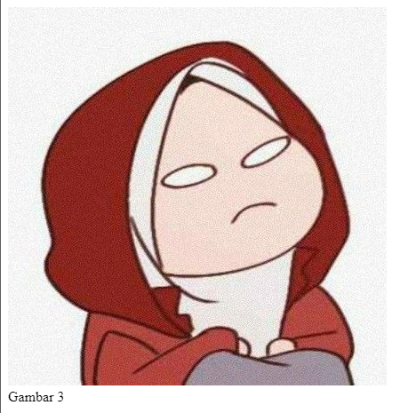<br>

**Pertanyaan 15:** Catat dan jelaskan perubahan yang terjadi berdasarkan hasil pengamatan Anda <br>

Pada koder diatas variabel `i` dibuat untuk menyimpan posisi gambar yang sedang ditampilkan. Ketika gambar berubah, variabel `i` akan berubah juga. Sehingga ketika gambar berubah, gambar yang sebelumnya ditampilkan akan hilang dan gambar baru akan ditampilkan. <br>

### **Praktikum 11. JQuery UI Plugin**

**Datepicker**<br>
`datepicker.html`

```html
<!DOCTYPE html>
<html lang="en">
  <head>
    <link rel="stylesheet" href="jquery-ui-1.14.0/jquery-ui.css" />
    <script type="text/javascript" src="jquery-3.7.1.js"></script>
    <script src="jquery-ui-1.14.0/jquery-ui.js"></script>
    <script>
      $(function () {
        $("#date_ex").datepicker();
      });
    </script>
  </head>
  <body>
    <div>Selected date: <input type="text" id="date_ex" /></div>
  </body>
</html>
```

**Hasil Percobaan**<br>
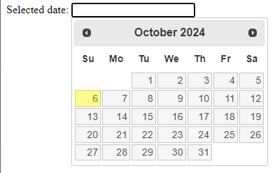<br>

**Pertanyaan 16:** Catat dan jelaskan perubahan yang terjadi berdasarkan hasil pengamatan Anda <br>

Pada kode diatas, ketika tombol diklik, akan menampilkan kalender yang dapat digunakan untuk memilih tanggal. Menggunakan plugin jqueryUI, kita bisa meamnfaatkan fungsi `.datepicker()` yang terdapat pada jqueryUI. <br>

**Accordion**<br>

`accordion.html`

```html
<!DOCTYPE html>
<html lang="en">
  <head>
    <link rel="stylesheet" href="jquery-ui-1.14.0/jquery-ui.css" />
    <script type="text/javascript" src="jquery-3.7.1.js"></script>
    <script src="jquery-ui-1.14.0/jquery-ui.js"></script>
    <script>
      $(function () {
        $("#jQuery_accordion").accordion();
      });
    </script>
  </head>
  <body>
    <div id="jQuery_accordion">
      <h3>header 1</h3>
      <p>This is section 1.
        Place your content here in paragraphs or use div elements etc.
      </p>
      <h3>header 2</h3>
      <p>This is section 2.
        You can also include images like this:
        <br>
      </p>
      <h3>header 3</h3>
      <div>
        <p>This is section 3.
          Content can include listing as well.
          <ol>
            <li>Item 1</li>
            <li>Item 2</li>
            <li>Item 3</li>
          </ol>
        </p>
      </div>
    </div>
  </body>
</html>
```

**Hasil Percobaan**<br>
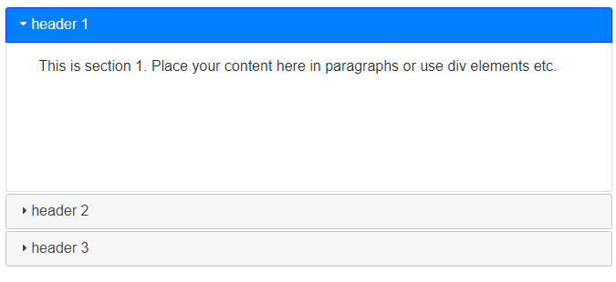<br>

**Pertanyaan 17:** Catat dan jelaskan perubahan yang terjadi berdasarkan hasil pengamatan Anda <br>

Pada kode diatas menggunakan fungsi `.accordion()` yang terdapat pada jqueryUI. Fungsi ini berfungsi untuk menampilkan konten yang ditentukan dalam bentuk panel yang dapat dibuka dan ditutup.<br>

### **Praktikum 12. JQuery AJAX**

`ajax.html`

```html
<!DOCTYPE html>
<html lang="en">
  <head>
    <script type="text/javascript" src="jquery-3.7.1.js"></script>
    <script>
      $(document).ready(function () {
        $("button").click(function () {
          $("#box").load("/praktik_jquery/test-content.html");
        });
      });
    </script>
  </head>
  <body>
    <div id="box">
      <h2>Klik tombol dibawah untuk memuat konten</h2>
    </div>
    <button type="button">Klik saya!</button>
  </body>
</html>
```

`test-content.html`

```html
<!DOCTYPE html>
<html lang="en">
  <head> </head>
  <body>
    <h1>Tutorial AJAX sederhana</h1>
    <p id="hint">Tutorial Fungsi Load()</p>
    <p></p>
  </body>
</html>
```

**Hasil Percobaan**<br>
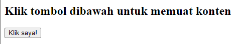<br>
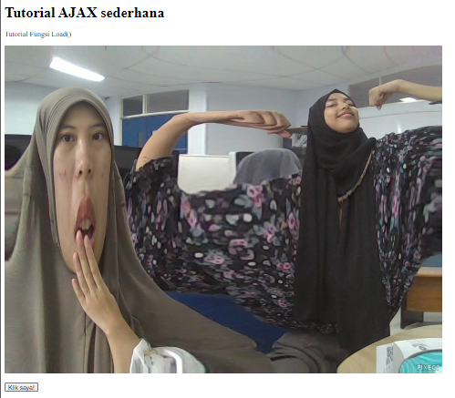<br>

**Pertanyaan 18:** Catat dan jelaskan perubahan yang terjadi berdasarkan hasil pengamatan Anda <br>

Pada kode diatas bisa dengan mengubah isi konten dari elemen `box` dengan isi dari file `test-content.html`, hal ini berguna untuk menampilkan konten yang dinamis.
