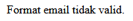

# Jobsheet 7 : Form Processing

**Nama :** Lavina<br>
**NIM :** 2342760062<br>
**Kelas :** SIB 2D<br>

### **Praktikum Bagian 1. Praktikum 1. Function Isset**

`isset.php`

```php
<?php

$umur;
if (isset($umur) && $umur >= 18) {
  echo "Anda sudah dewasa";
} else {
  echo "Anda belum dewasa atau variabel 'umur' tidak ditemukan";
}
```

**Hasil Percobaan**<br>
<br>

**Pertanyaan 1.1:** Apa yang anda pahami dari penggunaan isset pada file tersebut. Catat di bawah ini pemahaman anda. <br>

Ketika fungsi `isset()` dipanggil, fungsi ini akan mengecek apakah variabel yang dicari sudah diisi atau tidak.<br>

`isset.php`

```php
$data = array("nama" => "Jane", "usia" => 25);
if (isset($data["nama"])) {
  echo nl2br("\nNama: " . $data["nama"]);
} else {
  echo "Variabel 'nama' tidak ditemukan dalam array.";
}
```

**Hasil Percobaan**<br>
<br>

**Pertanyaan 1.2:** Apa yang anda pahami dari penggunaan isset pada file tersebut. Catat di bawah ini pemahaman anda. <br>

Fungsi `isset()` akan mengecek apakah variabel nama sudah diisi atau tidak. <br>

### **Praktikum 2. Function empty**

`empty.php`

```php
<?php

$myArray = array();
if (empty($myArray)) {
  echo "Array kosong";
} else {
  echo "Array tidak kosong";
}
```

**Hasil Percobaan**<br>
<br>

**Pertanyaan 2.1:** Apa yang anda pahami dari penggunaan empty pada file tersebut. Catat di bawah ini pemahaman anda. <br>

Fungsi `empty()` akan mengecek apakah array yang dicari kosong atau tidak. <br>

`empty.php`

```php
if (empty($nonExistentVar)) {
  echo "<br>Variabel kosong";
} else {
  echo "Variabel tidak kosong";
}
```

**Hasil Percobaan**<br>
<br>

**Pertanyaan 2.2:** Apa yang anda pahami dari penggunaan empty pada file tersebut. Catat di bawah ini pemahaman anda. <br>

Fungsi `empty()` akan mengecek variabel yang tidak ada atau belum dibuat sehingga outputnya kosong. <br>

### **Praktikum Bagian 3: Form Input PHP**

`form.php`

```php
<!DOCTYPE html>
<html>

<head>
  <title>Form Input PHP</title>
</head>

<body>
  <h2>Form Input PHP</h2>
  <form action="form_process.php" method="post">
    <label for="nama">Nama: </label>
    <input type="text" name="nama" id="nama" required><br><br>

    <label for="email">Email: </label>
    <input type="email" name="email" id="email" required><br><br>

    <input type="submit" name="submit" value="Submit">
  </form>
</body>

</html>
```

`form_process.php`

```php
<?php

if ($_SERVER["REQUEST_METHOD"] == "POST") {

  $nama = $_POST["nama"];
  $email = $_POST["email"];

  echo "Nama: " . $nama . "<br>";
  echo "Email: " . $email;
}
```

**Hasil Percobaan**<br>
<br>
<br>

**Pertanyaan 3.1:** Apa yang anda pahami dari penggunaan form pada file tersebut. Catat di bawah ini pemahaman anda. <br>

Form adalah struktur HTML yang digunakan untuk mengirimkan data dari user ke server. Form ini berisi input yang memiliki atribut `name` dan `email`. <br>

`form_self.php`

```php
<!DOCTYPE html>
<html>

<head>
  <title>Form Input PHP</title>
</head>

<body>
  <h2>Form Input PHP</h2>
  <?php
  $namaErr = "";
  $nama = "";

  if ($_SERVER["REQUEST_METHOD"] == "POST") {
    if (empty($_POST["nama"])) {
      $namaErr = "Nama harus diisi!";
    } else {
      $nama = htmlspecialchars($_POST["nama"]);
      echo "Data berhasil disimpan";
    }
  }
  ?>
  <form action="<?php echo htmlspecialchars($_SERVER["PHP_SELF"]); ?>" method="post">
    <label for="nama">Nama: </label>
    <input type="text" name="nama" id="nama" value="<?php echo $nama; ?>"><br><br>
    <span class="error"><?php echo $namaErr; ?></span><br><br>

    <input type="submit" name="submit" value="Submit">
  </form>
</body>

</html>
```

**Hasil Percobaan**<br>
<br>
<br>

**Pertanyaan 3.2:** Apa yang anda pahami dari penggunaan form pada file tersebut. Catat di bawah ini pemahaman anda. <br>

Form diatas memiliki action ke dalam file yang sama, ini berarti form ini akan mengirimkan data ke file yang sama. <br>

### **Praktikum Bagian 4. HTML Injection**

`html_aman.php`

```php
<!DOCTYPE html>
<html lang="en">

<head>
  <meta charset="UTF-8">
  <meta name="viewport" content="width=device-width, initial-scale=1.0">
  <title>HTML Aman</title>
</head>

<body>
  <form action="html_aman.php" method="post">
    <label for="input">Input : </label>
    <input type="text" name="input" id="input"></input>
    <input type="submit" value="Submit">
  </form>
</body>

</html>

<?php
$input = $_POST["input"] ?? '';
$input = htmlspecialchars($input, ENT_QUOTES, 'UTF-8');
echo $input;
?>
```

**Hasil Percobaan**<br>
<br>

**Pertanyaan 4.1:** Catat di sini apa yang anda amati dari penambahan kode program di atas. <br>

• $input berisi text yang akan kita filter <br>
• ENT_QUOTES menginstruksikan PHP untuk mengonversi tanda kutip tunggal (') dan tanda kutip ganda (") menjadi entitas HTML. Hal ini mencegah penggunaan tanda kutip untuk menyisipkan kode JavaScript berbahaya. <br>
• 'UTF-8' menkonversi jenis karakter yang digunakan. <br>

`html_aman.php`

```php
<!DOCTYPE html>
<html lang="en">

<head>
  <meta charset="UTF-8">
  <meta name="viewport" content="width=device-width, initial-scale=1.0">
  <title>HTML Aman</title>
</head>

<body>
  <form action="html_aman.php" method="post">
    <label for="input">Input : </label>
    <input type="text" name="input" id="input"></input>
    <label for="email">Email : </label>
    <input type="email" name="email" id="email"></input>
    <input type="submit" value="Submit">
  </form>
</body>

</html>

<?php
$input = $_POST["input"] ?? '';
$input = htmlspecialchars($input, ENT_QUOTES, 'UTF-8');
echo $input;

$email = $_POST['email'] ?? '';
if (filter_var($email, FILTER_VALIDATE_EMAIL)) {
  echo "Email: $email";
} else {
  echo "Email tidak valid";
}
?>
```

**Hasil Percobaan**<br>
<br>

**Pertanyaan 4.2:** Catat di sini apa yang anda amati dari penambahan kode program di atas. <br>

Kode diatas memvalidasi format penulisan email yang sesuai dengan parameter `FILTER_VALIDATE_EMAIL`. <br>

### **Praktikum 5. Penggunaan Regex Pada PHP**

`regex.php`

```php
<?php

$pattern = '/[a-z]/';
$text = 'This is Sample Text.';

if (preg_match($pattern, $text)) {
  echo "Huruf kecil ditemukan!";
} else {
  echo "Tidak ada huruf kecil!";
}
```

**Hasil Percobaan**<br>
<br><br>

**Pertanyaan 5.1:** Catat di sini apa yang anda amati dari penambahan kode program di atas. <br>

Kode diatas mengecek apakah ada huruf kecil di dalam variabel `$text`. <br>

`regex.php`

```php

$pattern = '/[0-9]+/';
$text = 'There are 123 apples.';

if (preg_match($pattern, $text, $matches)) {
  echo "Cocokkan: " . $matches[0];
} else {
  echo "Tidak ada yang cocok!";
}
```

**Hasil Percobaan**<br>
<br>

**Pertanyaan 5.2:** Catat di sini apa yang anda amati dari penambahan kode program di atas. <br>

Kode diatas mencocokkan apakah terdapat angka pada text dengan fungsi `preg_match()`. <br>

`regex.php`

```php
$pattern2 = '/apple/';
$replacement = 'banana';
$text2 = 'I like apple pie';
$new_text = preg_replace($pattern2, $replacement, $text2);
echo "<br>" . $new_text;
```

**Hasil Percobaan**<br>
<br>

**Pertanyaan 5.3:** Catat di sini apa yang anda amati dari penambahan kode program di atas. <br>

Kode diatas memanipulasi isi text yang sebelumnya apple diubah menjadi banana dengan menggunakan fungsi `preg_replace()`. <br>

`regex.php`

```php
$pattern3 = '/go*d/'; // god, good, goood
$text3 = 'god is good.';

if (preg_match($pattern3, $text3, $matches)) {
  echo "<br>Cocokkan: " . $matches[0];
} else {
  echo "Tidak ada yang cocok!";
}
```

**Hasil Percobaan**<br>
<br>

**Pertanyaan 5.4:** Catat di sini apa yang anda amati dari penambahan kode program di atas. <br>

Kode diatas menggunakan fungsi `preg_match()` untuk mencocokkan pola regex yang sudah dibuat. <br>

`regex.php`

```php
$pattern3 = '/\?/'; // god, good, goood
$text3 = 'god is good.';

if (preg_match($pattern3, $text3, $matches)) {
  echo "<br>Cocokkan: " . $matches[0];
} else {
  echo "Tidak ada yang cocok!";
}
```

**Hasil Percobaan**<br>
<br>

**Pertanyaan 5.5:** Catat di sini apa yang anda amati dari penambahan kode program di atas.<br>

 <br>

### **Praktikum 6. Form Lanjut**

`advance_form.php`

```php
<!DOCTYPE html>
<html lang="en">

<head>
  <title>Contoh Form dengan PHP</title>
</head>

<body>
  <h2>Form Contoh</h2>
  <form action="advance_process.php" method="POST">
    <label for="buah">Pilih Buah</label>
    <select name="buah" id="buah">
      <option value="apel">Apel</option>
      <option value="pisang">Pisang</option>
      <option value="mangga">Mangga</option>
      <option value="jeruk">Jeruk</option>
    </select>

    <br>

    <label>Pilih Warna Favorit:</label><br>
    <input type="checkbox" name="warna[]" value="merah"> Merah<br>
    <input type="checkbox" name="warna[]" value="biru"> Biru<br>
    <input type="checkbox" name="warna[]" value="hijau"> Hijau<br>

    <br>

    <label>Jenis Kelamin:</label><br>
    <input type="radio" name="jenis_kelamin" value="laki-laki"> Laki-laki<br>
    <input type="radio" name="jenis_kelamin" value="perempuan"> Perempuan<br>

    <br>

    <input type="submit" value="Submit">
  </form>
</body>

</html>
```

`advance_process.php`

```php
<?php

if ($_SERVER["REQUEST_METHOD"] == "POST") {
  $selectedBuah = $_POST['buah'];

  if (isset($_POST['warna'])) {
    $selectedWarna = $_POST['warna'];
  } else {
    $selectedWarna = [];
  }

  $selectedJenisKelamin = $_POST['jenis_kelamin'];
  echo "Anda memilih buah: " . $selectedBuah . "<br>";

  if (!empty($selectedWarna)) {
    echo "Warna favorit Anda: " . implode(" ", $selectedWarna) . "<br>"; // Join array elements with a string
  } else {
    echo "Tidak ada warna yang dipilih.<br>";
  }

  echo "Jenis kelamin Anda: " . $selectedJenisKelamin;
}
```

**Hasil Percobaan**<br>
<br>
<br>

**Pertanyaan 6.1:** Catat di sini apa yang anda amati dari penambahan kode program di atas. <br>

Pada file `advance_process.php` dilakukan pemeriksaan apakah ada data yang dikirim dengan method `POST` atau tidak. Jika ada, maka akan disimpan pada variabel buah, warna dan jenis kelamin, lalu ditampilkan ke layar. <br>

`form_ajax.php`

```php
<!DOCTYPE html>
<html lang="en">

<head>
  <title>Contoh Form dengan PHP</title>
  <!-- CDN JQuery -->
  <script src="https://code.jquery.com/jquery-3.7.1.min.js" integrity="sha256-/JqT3SQfawRcv/BIHPThkBvs0OEvtFFmqPF/lYI/Cxo=" crossorigin="anonymous"></script>
</head>

<body>
  <h2>Form Contoh</h2>
  <form id="myForm" action="advance_process.php" method="POST">
    <label for="buah">Pilih Buah</label>
    <select name="buah" id="buah">
      <option value="apel">Apel</option>
      <option value="pisang">Pisang</option>
      <option value="mangga">Mangga</option>
      <option value="jeruk">Jeruk</option>
    </select>

    <br>

    <label>Pilih Warna Favorit:</label><br>
    <input type="checkbox" name="warna[]" value="merah"> Merah<br>
    <input type="checkbox" name="warna[]" value="biru"> Biru<br>
    <input type="checkbox" name="warna[]" value="hijau"> Hijau<br>

    <br>

    <label>Jenis Kelamin:</label><br>
    <input type="radio" name="jenis_kelamin" value="laki-laki"> Laki-laki<br>
    <input type="radio" name="jenis_kelamin" value="perempuan"> Perempuan<br>

    <br>

    <input type="submit" value="Submit">
  </form>

  <div id="hasil">

  </div>

  <script>
    // JQuery
    // Agar saat form disubmit tidak perlu refresh page saat menampilkan formnya

    $(document).ready(function() {
      $("#myForm").submit(function(e) {
        e.preventDefault();

        var formData = $("#myForm").serialize();

        $.ajax({
          url: "advance_process.php",
          type: "POST",
          data: formData,
          success: function(response) {
            $("#hasil").html(response);
          }
        })
      })
    })
  </script>
</body>

</html>
```

**Hasil Percobaan**<br>
<br>

**Pertanyaan 6.2:** Catat di sini apa yang anda amati dari penambahan kode program di atas. <br>

Kode diatas menggunakan AJAX dari Jquery untuk mengirimkan data untuk diolah di file `advance_process.php`. Data yang telah diproses akan dikembalikan sebagai respons yang ditangkap oleh AJAX lalu ditampilkan ke layar. <br>

### **Praktikum 7. Validasi Form**

`validation_form.php`

```php
<!DOCTYPE html>
<html lang="en">

<head>
  <title>Document</title>
  <script src="https://code.jquery.com/jquery-3.7.1.min.js" integrity="sha256-/JqT3SQfawRcv/BIHPThkBvs0OEvtFFmqPF/lYI/Cxo=" crossorigin="anonymous"></script>
</head>

<body>
  <h1>Form Input dengan</h1>
  <form id="myForm" action="validation_process.php" method="post">
    <label for="nama">Nama:</label>
    <input type="text" name="nama" id="nama">
    <br>

    <label for="email">Email:</label>
    <input type="text" name="email" id="email">
    <br>

    <input type="submit" value="Submit">
  </form>
</body>

</html>
```

`validation_process.php`

```php
<?php

if ($_SERVER["REQUEST_METHOD"] == "POST") {
  $nama = $_POST['nama'];
  $email = $_POST['email'];
  $errors = array();

  if (empty($nama)) {
    $errors[] = "Nama harus diisi!";
  }

  if (empty($email)) {
    $errors[] = "Email harus diisi!";
  } else if (!filter_var($email, FILTER_VALIDATE_EMAIL)) {
    $errors[] = "Format email tidak valid!";
  }

  if (!empty($errors)) {
    foreach ($errors as $error) {
      echo $error . "<br>";
    }
  } else {
    echo "Data berhasil dikirim: Nama = $nama, Email = $email";
  }
}
```

**Hasil Percobaan**<br>
<br>
<br>

**Pertanyaan 7.1:** Catat dan jelaskan perubahan yang terjadi berdasarkan hasil pengamatan Anda <br>

Pada file `validation_process.php` dilakukan validasi apakah data yang dikirim formatnya benar atau tidak. Terdapat juga variabel `errors` yang berisi pesan kesalahan yang terjadi. Jika ada pesan kesalahan, maka akan dikembalikan ke layar. <br>

`validation_form.php`

```php
<!DOCTYPE html>
<html lang="en">

<head>
  <title>Document</title>
  <script src="https://code.jquery.com/jquery-3.7.1.min.js" integrity="sha256-/JqT3SQfawRcv/BIHPThkBvs0OEvtFFmqPF/lYI/Cxo=" crossorigin="anonymous"></script>
</head>

<body>
  <h1>Form Input dengan</h1>
  <form id="myForm" action="validation_process.php" method="post">
    <label for="nama">Nama:</label>
    <input type="text" name="nama" id="nama">
    <span id="nama-error" style="color: red;"></span>
    <br>

    <label for="email">Email:</label>
    <input type="text" name="email" id="email">
    <span id="email-error" style="color: red;"></span>
    <br>

    <input type="submit" value="Submit">
  </form>

  <script>
    $(document).ready(function() {
      $("#myForm").submit(function(event) {
        var nama = $("#nama").val();
        var email = $("#email").val();
        var valid = true;

        var formData = {
          nama: nama,
          email: email,
        };

        if (nama === "") {
          $("#nama-error").text("Nama harus diisi.");
          valid = false;
        } else {
          $("#nama-error").text("");
        }

        if (email === "") {
          $("#email-error").text("Email harus diisi.");
          valid = false;
        } else {
          $("#email-error").text("");
        }

        if (!valid) {
          event.preventDefault();
          return;
        }
      })
    })
  </script>
</body>

</html>
```

**Hasil Percobaan**<br>
<br>

**Pertanyaan 7.2:** Catat dan jelaskan perubahan yang terjadi berdasarkan hasil pengamatan Anda <br>

Kode diatas menggunakan `javascript` dan library `jQuery` untuk menguji apakah data yang dikirim formatnya benar atau tidak. Jika datanya kosong maka akan menampilkan pesan kesalahan. <br>

**Pertanyaan 7.3:** Buatlah script langkah 6 dengan menggunakan ajax. Catat di sini apa yang anda amati dari penambahan kode program di atas. <br>

`validation_form.php`

```php
<!DOCTYPE html>
<html lang="en">

<head>
  <title>Document</title>
  <script src="https://code.jquery.com/jquery-3.7.1.min.js" integrity="sha256-/JqT3SQfawRcv/BIHPThkBvs0OEvtFFmqPF/lYI/Cxo=" crossorigin="anonymous"></script>
</head>

<body>
  <h1>Form Input dengan</h1>
  <form id="myForm" action="validation_process.php" method="post">
    <label for="nama">Nama:</label>
    <input type="text" name="nama" id="nama">
    <span id="nama-error" style="color: red;"></span>
    <br>

    <label for="email">Email:</label>
    <input type="text" name="email" id="email">
    <span id="email-error" style="color: red;"></span>
    <br>

    <label for="password">Password:</label>
    <input type="password" name="password" id="password">
    <span id="password-error" style="color: red;"></span>
    <br>

    <input type="submit" value="Submit">
  </form>

  <div id="hasil"></div>

  <script>
    $(document).ready(function() {
      $("#myForm").submit(function(event) {
        var nama = $("#nama").val();
        var email = $("#email").val();
        var valid = true;

        var formData = {
          nama: nama,
          email: email,
        };

        if (nama === "") {
          $("#nama-error").text("Nama harus diisi.");
          valid = false;
        } else {
          $("#nama-error").text("");
        }

        if (email === "") {
          $("#email-error").text("Email harus diisi.");
          valid = false;
        } else {
          $("#email-error").text("");
        }

        if (!valid) {
          event.preventDefault();
          return;
        }

        $.ajax({
          url: "advance_process.php",
          type: "POST",
          data: formData,
          success: function(response) {
            $("#hasil").html(response);
          },
          error: function(xhr, status, error) {
            $("#hasil").html("Terjadi error: " + error);
          }
        })
      })
    })
  </script>
</body>

</html>
```

**Hasil Percobaan**<br>
<br>
<br>

**Pertanyaan 7.4:** Tambahkan validasi untuk password dengan ketentuan minimal 8 karakter dengan menggunakan jQuery dan PHP tambahkan pada langkah 9. Catat di sini apa yang anda amati dari penambahan kode program di atas. <br>

`validation_form.php`

```php
<!DOCTYPE html>
<html lang="en">

<head>
  <title>Document</title>
  <script src="https://code.jquery.com/jquery-3.7.1.min.js" integrity="sha256-/JqT3SQfawRcv/BIHPThkBvs0OEvtFFmqPF/lYI/Cxo=" crossorigin="anonymous"></script>
</head>

<body>
  <h1>Form Input dengan</h1>
  <form id="myForm" action="validation_process.php" method="post">
    <label for="nama">Nama:</label>
    <input type="text" name="nama" id="nama">
    <span id="nama-error" style="color: red;"></span>
    <br>

    <label for="email">Email:</label>
    <input type="text" name="email" id="email">
    <span id="email-error" style="color: red;"></span>
    <br>

    <label for="password">Password:</label>
    <input type="password" name="password" id="password">
    <span id="password-error" style="color: red;"></span>
    <br>

    <input type="submit" value="Submit">
  </form>

  <div id="hasil"></div>

  <script>
    $(document).ready(function() {
      $("#myForm").submit(function(event) {
        var nama = $("#nama").val();
        var email = $("#email").val();
        var password = $("#password").val();
        var valid = true;

        var formData = {
          nama: nama,
          email: email,
          password: password
        };

        if (nama === "") {
          $("#nama-error").text("Nama harus diisi.");
          valid = false;
        } else {
          $("#nama-error").text("");
        }

        if (email === "") {
          $("#email-error").text("Email harus diisi.");
          valid = false;
        } else {
          $("#email-error").text("");
        }

        if (password === "") {
          $("#password-error").text("Password harus diisi.");
          valid = false;
        } else if (password.length < 8) {
          $("#password-error").text("Password harus 8 karakter.");
          valid = false;
        } else {
          $("#email-error").text("");
        }

        if (!valid) {
          event.preventDefault();
          return;
        }

        $.ajax({
          url: "advance_process.php",
          type: "POST",
          data: formData,
          success: function(response) {
            $("#hasil").html(response);
          },
          error: function(xhr, status, error) {
            $("#hasil").html("Terjadi error: " + error);
          }
        })
      })
    })
  </script>
</body>

</html>
```

**Hasil Percobaan**<br>
<br>
